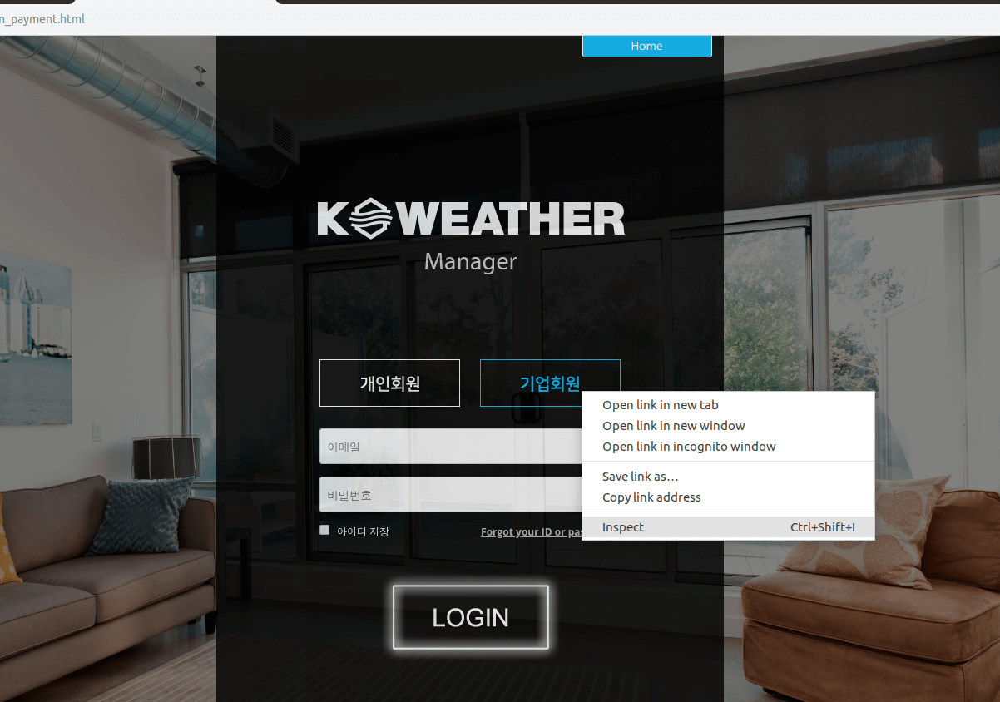
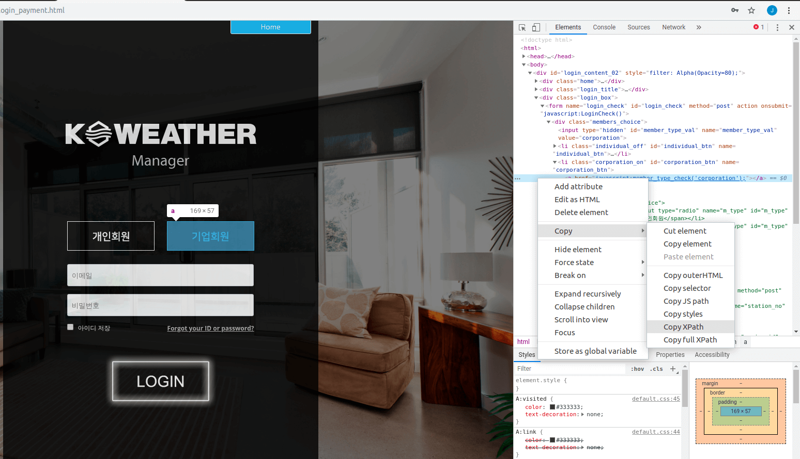
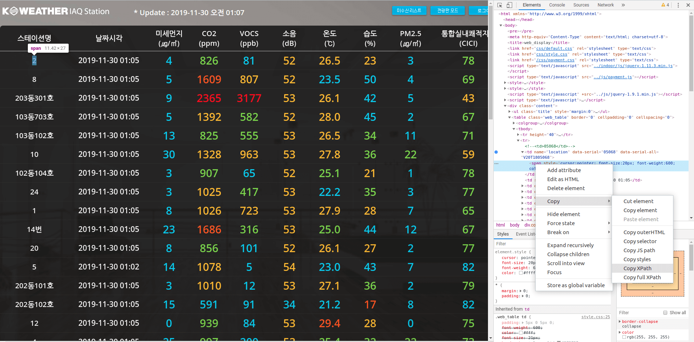

```{r setup, include=FALSE}
options(htmltools.dir.version = FALSE)
knitr::opts_chunk$set(echo = FALSE, fig.align = "center")
library(knitr);library(DT)
```


layout: true

<div class="my-footer"><span><a href="https://www.zarathu.com">Zarathu Co.,Ltd</a>   
&emsp;&emsp;&emsp;&emsp;&emsp;&emsp;&emsp;&emsp;&emsp;&emsp;&emsp;&emsp;&emsp;
&emsp;&emsp;&emsp;&emsp;&emsp;&emsp;&emsp;&emsp;&emsp;&emsp;&emsp;&emsp;&emsp;
<a href="https://github.com/jinseob2kim">김진섭</a></span></div> 


---

# Executive Summary 

.large[
웹에 로그인 후 클릭기반 데이터 다운받는 과정을 [RSelenium](https://github.com/ropensci/RSelenium) 으로 자동화 하였다.
]

--
.large[
- [Selenium docker image](https://hub.docker.com/r/selenium/standalone-chrome/) 를 이용, 복잡한 설치과정 없이 Selenium 을 실행하고 다운로드 경로를 설정하였다.
]
--

.large[
- `findElement` 와 `sendKeysToElement`, `clickElement` 를 이용, 아이디와 비번을 입력하고 로그인버튼을 클릭하였다.
]
--

.large[
- `clickElement` 이 안될 때 `mouseMoveToLocation` 과 `click` 을 이용, 마우스로 클릭하였다.
]
--

.large[
- 작업 팝업창을 바꾸는 `switchToWindow` 가 안될 때, `queryRD` 로 자체 함수를 만들어 작업하였다. 
]


--

.large[
- 50개 일별 데이터 다운로드에 성공하였다.  
]

---
# 목표: 로그인

.large[로그인]

<center>
<a href="http://biaqsm.airguardk.com/login_payment.html"></a>
</center>


---
# 목표: 테이블 클릭 

.large[스테이션 세부 기록 접근]

<center>

</center>


---
# 목표: 윈도우 변경

.large[각 스테이션 정보는 새 팝업창에서 확인]

<center>

</center>


---
# 목표: 데이터 다운로드

.large[날짜 설정, 다운로드 버튼 클릭]

<center>

</center>

---
# 목표: 50 스테이션 한번에 

.large[
50 스테이션 일별 데이터를 한번에 다운로드
]

<center>

</center>


---

class: center, middle

# Selenium 실행하기


---
# [Selenium docker image](https://hub.docker.com/r/selenium/standalone-chrome/)

.large[
도커 이용, 복잡한 설치과정 없이 바로 [Selenium](https://selenium.dev/) 실행.

- 다운로드 폴더 지정: **`-v 내디렉토리:/home/seluser`**

- 메모리 옵션 설정 **`--shm-size="1g"`** 

    + 특정 사이트 접근 안될 때


```sh
docker run -p 4445:4444 --shm-size="1g"  -v /home/jinseob2kim/Dropbox/R/RSelenium:/home/seluser selenium/standalone-chrome
```

]


Windows: **디렉토리 구분은 '/'**

```sh
docker run -p 4445:4444 --shm-size="1g"  -v c:/Downloads:/home/seluser selenium/standalone-chrome
```

---
# [RSelenium](https://github.com/ropensci/RSelenium)

.large[
`remoteDriver` 함수로 Selenium 연결.

```r
library(RSelenium)

remDr <- remoteDriver(
  remoteServerAddr = "localhost",
  port = 4445L,
  browserName = "chrome"
)
```

[다른 docker image](https://github.com/SeleniumHQ/docker-selenium) 이용하면 firefox, IE 도 가능
]


---
# 웹 접속 

```r
remDr$open()
remDr$navigate("http://biaqsm.airguardk.com/login_payment.html")
```

- 실행해도 브라우저가 안열린다? 

- Docker 내부에서 잘 실행되고 있고, 스크린샷과 url 주소 확인 가능.

```r
remDr$screenshot(display = T)
remDr$getCurrentUrl()
remDr$getTitle()
remDr$refresh()
```

종료 

```r
remDr$close()
```

---

class: center, middle

# Selenium으로 작업하기

---
# Element 찾기

.large[
원하는 항목에 마우스 우클릭 후 **Inspect** 클릭
]

<center>

</center>


---
# Element 찾기(2)

.large[
파란 줄에 마우스 우클릭 후 **Copy XPath** 클릭
]

<center>

</center>


---
# Element 다루기

`findElement` 에 **복사한 XPath 를 입력**.

```r
## 기업회원
co_btn <- remDr$findElement(using="xpath",value='//*[@id="corporation_btn"]/a')

## ID, password
txt_email <- remDr$findElement(using="xpath",value='//*[@id="id"]')
txt_password <- remDr$findElement(using="xpath",value='//*[@id="pwd"]')

## Login button
login_btn <- remDr$findElement(using="xpath",value='//*[@id="login"]')
```

`clickElement()`: 클릭 

`sendKeysToElement`: 값 입력

```r
co_btn$clickElement()
txt_email$sendKeysToElement(list("MYEMAIL"))
txt_password$sendKeysToElement(list("MYPASSWORD"))
login_btn$clickElement()
```

---
# Element in Table

XPath 에 **행렬정보** 표시, 전부 조사할 필요 없음.

<center>

</center>

**XPath**: '/html/body/div/table/tbody/tr[2]/td[1]/span'


---
# `clickElement()` 안될 때

.large[
- 테이블의 "스테이션명" 을 클릭하면 새 팝업창이 떠야 함


- 그러나 `clickElement()` 실행해도 아무 변화 없음.


- 마우스 커서 옮겨 클릭: `mouseMoveToLocation`, `click`
]


```r
st_2_btn <- remDr$findElement(using="xpath",value= paste0('/html/body/div/table/tbody/tr[', snum + 1, ']/td[1]/span'))

## Mouse button location
remDr$mouseMoveToLocation(webElement = st_2_btn)

## Mouse click
remDr$click(buttonId = 'LEFT')
```

---
# 새 팝업창 다루기

전체 팝업창 목록: `getWindowHandles()`

```r
> remDr$getWindowHandles()
[[1]]
[1] "CDwindow-F025DEFF3349C7361962B0402AA09F98"

[[2]]
[1] "CDwindow-CB609E654550958A16E2824AD3E435AE"
```

현재 팝업창 확인: `getCurrentWindowHandle()`

```r
> remDr$getCurrentWindowHandle()
[[1]]
[1] "CDwindow-F025DEFF3349C7361962B0402AA09F98"
```

팝업창 바꾸기: `switchToWindow()`

```r
> remDr$switchToWindow("CDwindow-CB609E654550958A16E2824AD3E435AE")
> remDr$getCurrentWindowHandle()
[[1]]
[1] "CDwindow-F025DEFF3349C7361962B0402AA09F98"
```


---
# 팝업창 안바뀔 때 

.large[
자체 함수 만들기: https://github.com/ropensci/RSelenium/issues/143 
]


```r
myswitch <- function (remDr, windowId){
  qpath <- sprintf("%s/session/%s/window", remDr$serverURL, remDr$sessionInfo[["id"]])
  remDr$queryRD(qpath, "POST", qdata = list(handle = windowId))
}
```
.large[
팝업창 바뀌는 것 확인 
]

```r
> myswitch(remDr, "CDwindow-CB609E654550958A16E2824AD3E435AE")
> remDr$getCurrentWindowHandle()
[[1]]
[1] "CDwindow-CB609E654550958A16E2824AD3E435AE"
```


---
# 50개 Station 일별 데이터 다운

.large[
아래 작업을 함수로 만듦.

- 스테이션 이름 클릭하여 해당 스테이션에 대한 **새 팝업창** 띄우기


- 새 팝업창으로 이동 


- 다운받을 **년, 월, 일** 설정 


- **데이터 파일 다운로드** 버튼 클릭 


- 팝업창 끄고(`closeWindow()`) 이전 팝업창으로 돌아가기


]


---


```r
## `snum`: 몇번째 스테이지? (1-50)
DownStage <- function(snum, yr, month, day){
  st_2_btn <- remDr$findElement(using="xpath",value= paste0('/html/body/div/table/tbody/tr[', snum + 1, ']/td[1]/span'))
  remDr$mouseMoveToLocation(webElement = st_2_btn)
  remDr$click(buttonId = 'LEFT')
  myswitch(remDr, remDr$getWindowHandles()[[2]])
* Sys.sleep(2)
  remDr$findElement(using="xpath",value='//*[@id="timed_year"]')$sendKeysToElement(list(paste0(yr, "년")))
  remDr$findElement(using="xpath",value='//*[@id="timed_month"]')$sendKeysToElement(list(paste0(month, "월")))
  remDr$findElement(using="xpath",value='//*[@id="timed_day"]')$sendKeysToElement(list(paste0(day, "일")))
  remDr$findElement(using="xpath",value='//*[@id="table-example"]/thead/tr[3]/td/form/a')$clickElement()
  remDr$findElement(using="xpath",value='//*[@id="theme-wrapper"]/div/div/div/div/div[4]/input[4]')$clickElement()
  
  remDr$closeWindow()
  myswitch(remDr, remDr$getWindowHandles()[[1]])
* Sys.sleep(2)
  cat(paste0(snum, "th data download\n"))
}
```

팝업창 바꿀 때마다 여유시간 필요: `Sys.sleep(2)` 는 2초 쉬기 

```r
## Download 50 stage: 2019-11-02
for (i in 1:50){
  DownStage(i, 2019, 11, 02)
}
```


---
# 더 알아볼 내용: 캘린더 형태

**날짜 바로 입력 안됨**

- **이전달, 다음달** 클릭

- 11월 6일은 캘린더의 **3행 5열**

**XPath**:  '//*[@id="ui-datepicker-div"]/table/tbody/tr[3]/td[5]/a'


<center>

</center>


---

# Executive Summary 

.large[
웹에 로그인 후 클릭기반 데이터 다운받는 과정을 [RSelenium](https://github.com/ropensci/RSelenium) 으로 자동화 하였다.

- [Selenium docker image](https://hub.docker.com/r/selenium/standalone-chrome/) 를 이용, 복잡한 설치과정 없이 Selenium 을 실행하고 다운로드 경로를 설정하였다.


- `findElement` 와 `sendKeysToElement`, `clickElement` 를 이용, 아이디와 비번을 입력하고 로그인버튼을 클릭하였다.


- `clickElement` 이 안될 때 `mouseMoveToLocation` 과 `click` 을 이용, 마우스로 클릭하였다.


- 작업 팝업창을 바꾸는 `switchToWindow` 가 안될 때, `queryRD` 로 자체 함수를 만들어 작업하였다. 


- 50개 일별 데이터 다운로드에 성공하였다.  
]

---

class: center, middle

# END
