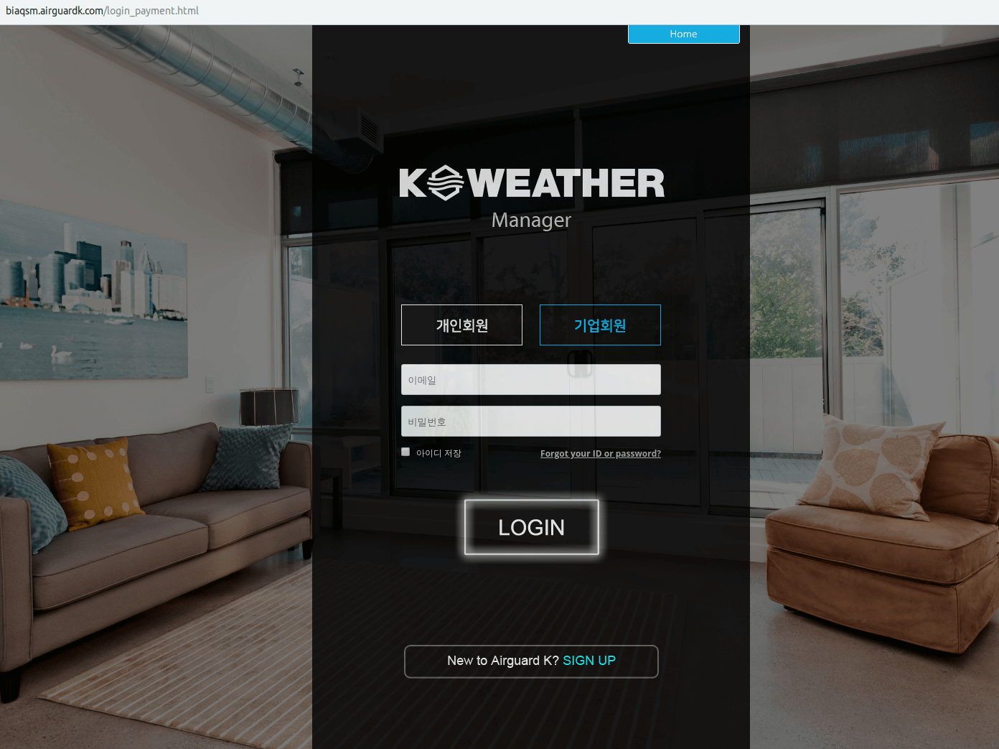
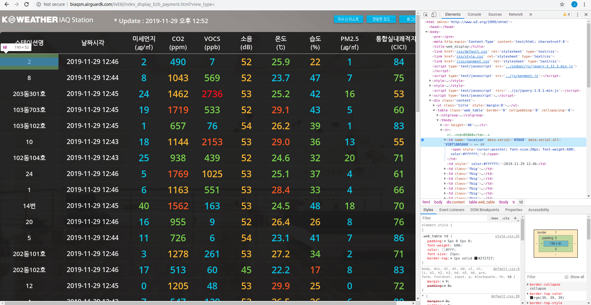
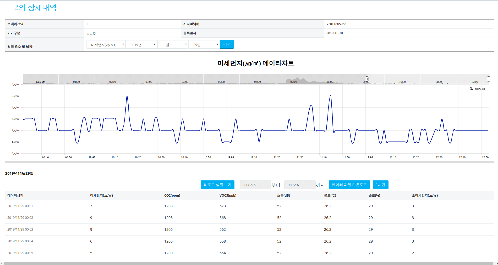
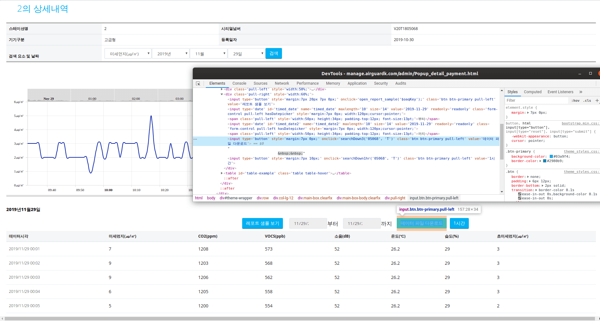
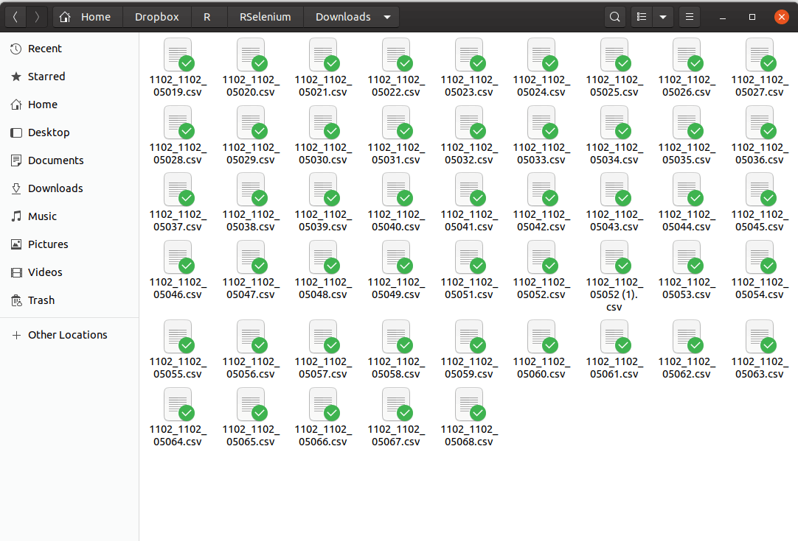

```{r setup, include=FALSE}
options(htmltools.dir.version = FALSE)
knitr::opts_chunk$set(echo = FALSE, fig.align = "center")
library(knitr);library(DT)
```


layout: true

<div class="my-footer"><span><a href="https://www.zarathu.com">Zarathu Co.,Ltd</a>   
&emsp;&emsp;&emsp;&emsp;&emsp;&emsp;&emsp;&emsp;&emsp;&emsp;&emsp;&emsp;&emsp;
&emsp;&emsp;&emsp;&emsp;&emsp;&emsp;&emsp;&emsp;&emsp;&emsp;&emsp;&emsp;&emsp;
<a href="https://github.com/jinseob2kim">김진섭</a></span></div> 


---

# Executive Summary 

.large[
웹에 로그인 후 클릭기반 데이터 다운받는 과정을 [RSelenium](https://github.com/ropensci/RSelenium) 으로 자동화 하였다.
]

--
.large[
- [Selenium docker image](https://hub.docker.com/r/selenium/standalone-chrome/) 를 이용, 복잡한 설치과정 없이 Selenium 을 실행하고 다운로드 경로를 설정하였다.
]
--

.large[
- `findElement` 와 `sendKeysToElement`, `clickElement` 를 이용, 아이디와 비번을 입력하고 로그인버튼을 클릭하였다.
]
--

.large[
- `clickElement` 이 안될 때 `mouseMoveToLocation` 과 `click` 을 이용, 마우스로 클릭하였다.
]
--

.large[
- 작업 팝업창을 바꾸는 `switchToWindow` 가 안될 때, `queryRD` 로 자체 함수를 만들어 작업하였다. 
]


--

.large[
- 50개 일별 데이터 다운로드에 성공하였다.  
]

---
# 목표: 로그인

.large[로그인]

<center>
<a href="http://biaqsm.airguardk.com/login_payment.html"></a>
</center>


---
# 목표: 테이블 클릭 

.large[스테이션 세부 기록 접근]

<center>

</center>


---
# 목표: 윈도우 변경

.large[각 스테이션 정보는 새 팝업창에서 확인]

<center>

</center>


---
# 목표: 데이터 다운로드

.large[날짜 설정, 다운로드 버튼 클릭]

<center>

</center>

---
# 목표: 50 스테이션 한번에 

.large[
50 스테이션 일별 데이터를 한번에 다운로드
]

<center>

</center>


---

class: center, middle

# Selenium


---
# [Selenium docker image](https://hub.docker.com/r/selenium/standalone-chrome/)

.large[
도커 이용, 복잡한 설치과정 없이 바로 [Selenium](https://selenium.dev/) 실행.

- 다운로드 폴더 지정: **`-v 내디렉토리:/home/seluser`**

- 메모리 옵션 설정 **`--shm-size="1g"`** 

    + 특정 사이트 접근 안될 때


```sh
docker run -p 4445:4444 --shm-size="1g"  -v /home/jinseob2kim/Dropbox/R/RSelenium:/home/seluser selenium/standalone-chrome
```

]


Windows: **디렉토리 구분은 '/'**

```sh
docker run -p 4445:4444 --shm-size="1g"  -v c:/Downloads:/home/seluser selenium/standalone-chrome
```


---

# Executive Summary 

.large[
웹에 로그인 후 클릭기반 데이터 다운받는 과정을 [RSelenium](https://github.com/ropensci/RSelenium) 으로 자동화 하였다.

- [Selenium docker image](https://hub.docker.com/r/selenium/standalone-chrome/) 를 이용, 복잡한 설치과정 없이 Selenium 을 실행하고 다운로드 경로를 설정하였다.


- `findElement` 와 `sendKeysToElement`, `clickElement` 를 이용, 아이디와 비번을 입력하고 로그인버튼을 클릭하였다.


- `clickElement` 이 안될 때 `mouseMoveToLocation` 과 `click` 을 이용, 마우스로 클릭하였다.


- 작업 팝업창을 바꾸는 `switchToWindow` 가 안될 때, `queryRD` 로 자체 함수를 만들어 작업하였다. 


- 50개 일별 데이터 다운로드에 성공하였다.  
]

---

class: center, middle

# END
