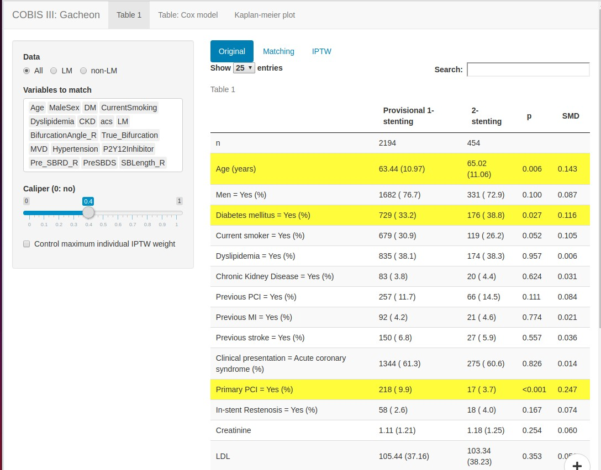
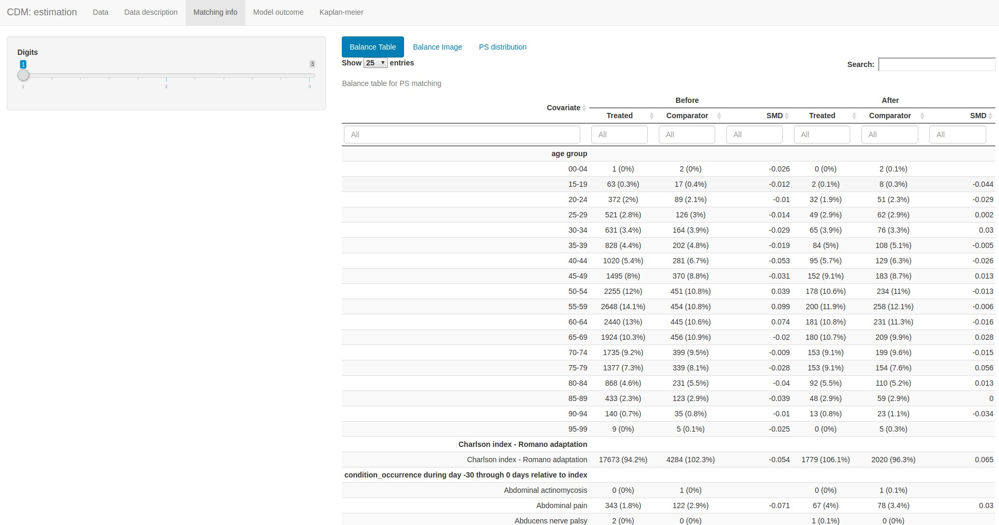
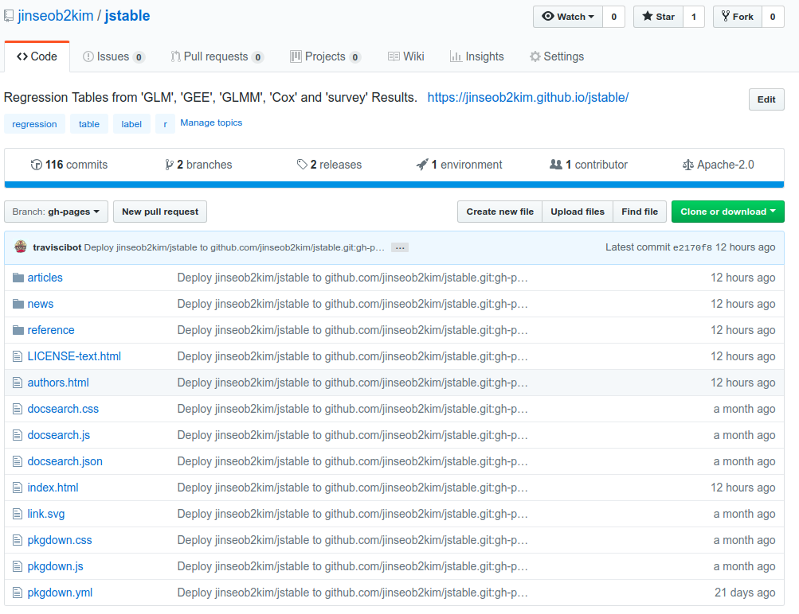
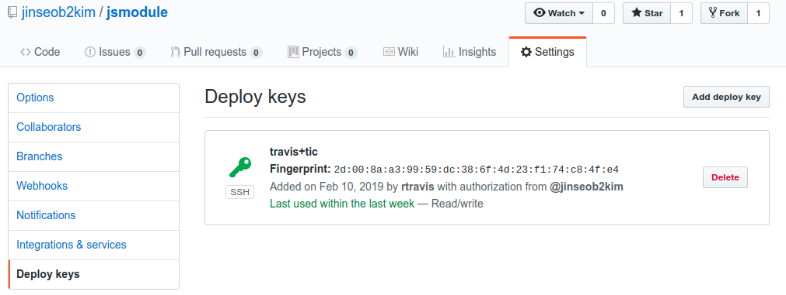

```{r setup, include=FALSE}
options(htmltools.dir.version = FALSE)
knitr::opts_chunk$set(echo = FALSE, fig.align = "center")
library(knitr);library(DT);library(dplyr);library(data.table);library(rmarkdown);library(readr);library(purrr);library(tidyr)
```


class:  bg-main1

# Executive Summary 

- 의학연구자들에게 맞춤형 **[ShinyApps](https://shiny.rstudio.com/)**를 제공하고, 범용으로 쓰일만한 것들을 **[Shiny module](https://shiny.rstudio.com/articles/modules.html)**로 만든 후, **[웹](http://app.zarathu.com)**을 통해 배포하였다. 


--
- 개인 PC에서 직접 이용할 수 있도록 **[Rstudio Addins](https://rstudio.github.io/rstudioaddins/)**을 포함한 패키지로 만들어 **github**에 배포하였다.


--
- **[testthat](https://github.com/r-lib/testthat)**, **[covr](https://github.com/r-lib/covr)**로 코드 테스트를 수행하고 결과 리포트를 만들었으며, **[pkgdown](https://github.com/r-lib/pkgdown)**으로 패키지를 소개하는 웹사이트를 만들었다. 


--
- **[Travis CI](https://travis-ci.org/)**와 **[appveyor](https://www.appveyor.com/)**로 앞의 과정과 여러 운영체제에서의 테스트를 자동화하였다. 


--
- 최종적으로 **[CRAN](https://cran.r-project.org/)**에 패키지를 배포하고, .yellow[V1.0.1] 까지 업데이트 하였다.


---

class: middle bg-main1

# 맞춤형 ShinyApps


---
class:  bg-main1

# 연구지원 분류

* 통계 분석
    + 일반 데이터: Table 1, 회귀분석, 생존분석
    
    + 반복측정: GEE(Generalized Estimating Equation)
    
    + 표본조사: [국민건강영양조사](https://knhanes.cdc.go.kr/knhanes/main.do)
    
    + Propensity score 분석: Matching, IPTW

    
* [공통데이터모델(Common Data Model, CDM)](http://www.feedernet.org/html/) 결과 확인.

* 심혈관 생리학 지표 계산: .yellow[드래그] 

* 정신질환 .yellow[네트워크 분석]


---
class:  bg-main1

# 일반데이터: 시야

### 기술통계, 회귀/생존분석, 간단한 그림

<a href="http://app.zarathu.com"></a>


---
class:  bg-main1

# 신장이식 

### 기술통계, 회귀/생존분석, 맞춤형 그림

<a href="http://147.47.68.165:1111/LeeKW/KTsym/"></a>


---
class:  bg-main1

# Tip 1: 그림 편집

.large[
Shiny에서 모든 편집옵션 지원불가, .yellow[직접 편집] 가능해야 함.

- `svg` 확장자: [Cairo](https://CRAN.R-project.org/package=Cairo) 패키지 이용, [Inkscape](https://inkscape.org/ko/)에서 편집. `ggsave()` 지원.


- `emf` 확장자: [devEMF](https://cran.r-project.org/package=devEMF) 패키지 이용, **PPT**에서 편집, `ggsave()` 지원 안함.


 윈도우 환경에서는 `wmf` 확장자 이용,  `ggsave()` 저장 후 **PPT** 편집 가능.
 ]

---
class:  bg-main1
# Example: `emf`

**PPT** 정확한 그림인식 위해 .yellow[`emfPlus = F`] 옵션 필수!

```{r, echo = T, eval = F}
library(devEMF)
*emf("plot.emf", width = 7, height = 7, emfPlus = F)
ggplot(mtcars, aes(mpg, cyl)) + geom_point()
dev.off()
```

```{r, out.width= "70%"}
include_graphics("https://raw.githubusercontent.com/jinseob2kim/PresentationShinyMed/master/docs/zzz.png")
```

---
class:  bg-main1

# Tip 2: 테이블 다운로드 

[DT](https://rstudio.github.io/DT) 패키지의 `datatable` 함수

```{r, eval = F, echo= T}
datatable(
*   iris, extensions = 'Buttons', options = list(
*   dom = 'Bfrtip',  # Button, filter, processing, table, information, pagination                              
*   buttons = c('copy', 'csv', 'excel', 'pdf', 'print'),
    scrollX = T      # Scrolling X axis
  )
)
```

세부 `dom` 설정은 [여기](https://datatables.net/reference/option/dom) 

---
class:  center

```{r}
datatable(
  iris, extensions = 'Buttons', options = list(
    dom = 'Bfrtip',  # Button, filter, processing, table, information, pagination                              
    buttons = c('copy', 'csv', 'excel', 'pdf', 'print'),
    scrollX = T      # Scrolling X axis
  )
)
```

---
class:  bg-main1
# Tip 3: `dropdownButton`

### [shinyWidgets](https://github.com/dreamRs/shinyWidgets) Package

```{r, out.width="50%", fig.show = "hold",  fig.align = "default"}
knitr::include_graphics(c('https://github.com/dreamRs/shinyWidgets/raw/master/man/figures/dropdown_btn_off.png', 'https://github.com/dreamRs/shinyWidgets/raw/master/man/figures/dropdown_btn_on.png'))
```


```r
shinyWidgets::dropdownButton(
  tags$h3("List of Input"),
  selectInput(inputId = 'xcol', label = 'X Variable', choices = names(iris)),
  selectInput(inputId = 'ycol', label = 'Y Variable', choices = names(iris), selected = names(iris)[[2]]),
  sliderInput(inputId = 'clusters', label = 'Cluster count', value = 3, min = 1, max = 9),
  circle = TRUE, status = "danger", icon = icon("gear"), width = "300px",
  tooltip = tooltipOptions(title = "Click to see inputs !"))
```

---
class: middle bg-main1

# Tip 4: Login module for ShinyApps


---
class: middle bg-main1

# Executive Summary 

<br>

### [shinymanager](https://github.com/datastorm-open/shinymanager) 로 .yellow[UI 종류에 상관없이], 간단하게 로그인기능을 추가한다.


### [SQLite db](https://db.rstudio.com/databases/sqlite/) 를 이용, 접속자와 그 log를 관리한다.


---
class: middle bg-main1

# [shinymanager](https://github.com/datastorm-open/shinymanager) 없던 시절..


---
class: bg-main1

# 직접 만들기 

### `passwordInput` in shiny


<a href="https://stackoverflow.com/questions/41168459/r-shiny-user-authentication-for-single-app-r"></a>


### 뭔가 아쉽다.

http://app.zarathu.com/password-exam/


---
class: bg-main1

# [Google Auth0](https://auth0.com/blog/adding-authentication-to-shiny-server/) 

```{r, out.width="80%"}
include_graphics("https://raw.githubusercontent.com/zarathucorp/dhh2018/master/img/auth0.gif")
```

### 복잡, App 별로 따로 안되는듯.


---
class: bg-main1

# [shinyauthr](https://github.com/PaulC91/shinyauthr)

```{r, out.width="100%"}
include_graphics("https://user-images.githubusercontent.com/30856173/49153332-bb7a0900-f315-11e8-8a06-2375d299a766.png")
```

<br><br>
### 쉬움. https://cultureofinsight.shinyapps.io/shinyauthr/

### navbar UI 에 적용이 어려움. http://app.zarathu.com/basicpass/


---
class: bg-main1

# [useR 2019 후기](https://ryo-n7.github.io/2019-07-21-user2019-reflections/)를 읽던 중

```{r, out.width="100%"}
knitr::include_graphics("https://raw.githubusercontent.com/jinseob2kim/LectureRpackage/master/docs/shinymanager/fig-shinymanager/user2019_shinymanager.jpg")
```


---
class: middle bg-main1

# [shinymanager](https://github.com/datastorm-open/shinymanager) 소개


---
layout: true
class: split-four white

.split-four[
.row.bg-main1[.content[
  `install.packages("shinymanager")`
  
  Demo: http://shinyapps.dreamrs.fr/shinymanager-demo/ (id & password: .yellow[shinymanager])

]]

.row.bg-main2[.content[
### Make User info
  ```
credentials <- data.frame(
  user = c("shiny", "shinymanager"),
  password = c("azerty", "12345"),
  admin = c(T, F), stringsAsFactors = FALSE)
```
]]

.row.bg-main3[.content[
### Apply to UI
```
ui <- secure_app(ui, enable_admin = T)
```
]]


.row.bg-main4[.content[
### In server
```
res_auth <- secure_server(
    check_credentials = check_credentials(credentials)
  )

```
]]
]

---
class: fade-row2 fade-row3 fade-row4
---
class: fade-row1 fade-row3 fade-row4
---
class: fade-row1 fade-row2 fade-row4
---
class: fade-row1 fade-row2 fade-row3
---
class:


---
layout:false
class: bg-main1

# `app.R` Example

```r
credentials <- data.frame(
  user = c("shiny", "shinymanager"),
  password = c("shiny", "shinymanager"), stringsAsFactors = FALSE)

library(shiny);library(shinymanager)

ui <- fluidPage(
  tags$h2("My secure application"),
  verbatimTextOutput("auth_output")) 

ui <- secure_app(ui)

server <- function(input, output, session) {
  res_auth <- secure_server(check_credentials = check_credentials(credentials))
  
  output$auth_output <- renderPrint({
    reactiveValuesToList(res_auth)
  })
}

shinyApp(ui, server)
```

---
layout: false
class:bg-main1

```{r}
include_graphics("https://ryo-n7.github.io/assets/2019-07-21-user2019-reflections_files/shinymanager.PNG")
```

---
class: split-two white

.row.bg-main1[.content[
# `dataframe` 은 .yellow[admin], .yellow[log] 기능 안됨.
<br>

```r
ui <- secure_app(ui, enable_admin = T)
```
## Option doesn't run.

]]
.row.bg-main2[.content.vmiddle.center[
# Need .yellow[DB]: for dynamic update.
<br><br>
# [shinymanager](https://github.com/datastorm-open/shinymanager) supports [RSQLite](https://db.rstudio.com/databases/sqlite/)
<br>

### Simple .yellow[DB] with 1 file


]]


---
layout: true
class: split-two white

.row.bg-main1[.content[
### Make User info: no .yellow[DB]
```
credentials <- data.frame(
  user = c("shiny", "shinymanager"),
  password = c("azerty", "12345"),
  admin = c(T, F), stringsAsFactors = FALSE)
```
### In server
```
res_auth <- secure_server(
    check_credentials = check_credentials(credentials))

```


]]
.row.bg-main2[.content[
### Make User info: .yellow[DB]
```
credentials <- data.frame(
  user = c("shiny", "shinymanager"),
  password = c("azerty", "12345"),
  admin = c(T, F), stringsAsFactors = FALSE)

*create_db(credentials_data = credentials, sqlite_path = "database.sqlite") 
```
### In server
```
res_auth <- secure_server(
*   check_credentials = check_credentials("database.sqlite"))
```

]]

---
class: fade-row2
---
class: fade-row1
---
class:


---
layout: false
class: bg-main1

# .yellow[Caution] 

<br><br><br><br>

### [Shiny server](https://www.rstudio.com/products/shiny/shiny-server/) 통한 로그는 접근권한을 바꿔야.

```shell
chmod 777 -R <App directory>  ## write permission to all user
```

https://github.com/datastorm-open/shinymanager/issues/6


---
class: bg-main1

# Secure .yellow[DB] with [keyring](https://github.com/r-lib/keyring) package


```r
library(keyring)
key_set("R-shinymanager-key", "appname")
```

```{r, out.width="80%"}
include_graphics("https://raw.githubusercontent.com/jinseob2kim/LectureRpackage/master/docs/shinymanager/fig-shinymanager/keyring.jpg")
```


---
class:bg-main1

# When create .yellow[DB]

```r
create_db(
  credentials_data = credentials,
  sqlite_path = "database.sqlite", 
* passphrase = key_get("R-shinymanager-key", "appname")
)
```

--
# .yellow[Caution]

.blockquote.font_large[
Linux 에선 key 가 `environment variables` 로 저장됨.<br><br>
Shiny server 에도 적용하려면 user `shiny` 에도 `environment variables` 추가해야 함.
]


---
class: bg-main1
# 반복측정: 심혈관질환 위험요인

 [geepack](https://cran.r-project.org/web/packages/geepack/index.html) 패키지 적용, 한 사람이 2개 이상의 심혈관 시술 받음. 

<a href="http://app.zarathu.com"></a>


---
class: bg-main1
# 표본조사: 국민건강영양조사

[survey](http://r-survey.r-forge.r-project.org/survey/) 패키지 적용, 표본가중치 고려한 통계

<a href="http://app.zarathu.com"></a>


---
class: bg-main1

# Propensity score: 심혈관시술 효과

[MatchIt](https://CRAN.R-project.org/package=MatchIt) 패키지 적용, .yellow[matching & IPTW]

<center><a href="http://147.47.68.165:1111/COBIS_gacheon/"></a></center>


---
class: bg-main1
# 공통데이터모델(CDM) 결과 확인.

[zip](https://cran.r-project.org/package=zip) 패키지 이용, 결과 들어있는 .yellow[zip] 업로드하여 확인.

<center><a href="http://147.47.68.165:1111/cdm/estimation"></a></center>

---
class: bg-main1

# Tip 5: Don't use `utils::zip` 

기본함수인 `utils::zip` 은 .yellow[shiny] 와 궁합이 안좋음. `directory` 인식 문제

```r
userFile <- eventReactive(input$file, {
    input$file
  })
  
data <- eventReactive(input$file, {
*   tmp <- tempfile()
*   zip::unzip(userFile()$datapath, exdir = tmp)
*   ref <- readRDS(paste0(tmp, "/result/outcomeModelReference.rds"))
    return(list(dir = tmp, ref = ref))
  })

```

---
class: bg-main1
# 심혈관 생리지표 계산

최대최소값 표시 & [brush](https://shiny.rstudio.com/articles/plot-interaction.html) 이용 [드래그](https://shiny.rstudio.com/gallery/plot-interaction-advanced.html)한 부분의 생리지표를 계산

<center><a href="http://app.zarathu.com"></a></center>


---
class: bg-main1
# PTSD 네트워크 분석

[qgraph](https://CRAN.R-project.org/package=qgraph) 패키지 이용. [colourpicker](https://github.com/daattali/colourpicker), [shinyWidgets](https://github.com/dreamRs/shinyWidgets) 패키지로 색상 선택 UI.

<center><a href="http://app.zarathu.com"></a></center>


---
class: middle bg-main1

# 범용 ShinyApps

---
class:  bg-main1
# 데이터 형태따라 분류

데이터 형태에 따라 3개로 따로 만듦. 기술통계, 회귀분석/생존분석, ROC 분석을 포함. 

* [일반 데이터](http://app.zarathu.com/basic)


* [반복측정 데이터](http://app.zarathu.com/repeated) - 한 사람이 여러번 측정함, [GEE](https://en.wikipedia.org/wiki/Generalized_estimating_equation) 기반의 분석 필요.


* [표본조사(survey) 데이터](http://app.zarathu.com/survey) - 샘플가중치 존재(ex: 국건영)


* [프로펜시티 점수 분석]((http://app.zarathu.com/ps)(experimental)


---
class:  bg-main1
# Problem 1: .yellow[File size limit]

Shiny `fileInput`은 5메가 이하까지만 지원. 

--

사실, 용량 제한 바꿀 수 있음. `shiny.maxRequestSize` 옵션을 **app.R**에 추가.


```{r, echo=T, eval = F}
## change to 30mb
*options(shiny.maxRequestSize = 30*1024^2)

ui <- navbarPage("Basic statistics",
                   tabPanel("Data",
                            
```

--

서버 부하가 부담. 큰 데이터는 개인 컴퓨터에서 직접 하면 좋겠다. 

---
class:  bg-main1
# Problem 2: 인터넷 차단 환경

- 공단 빅데이터 분석실은 인터넷 접속 원천차단. 

- [CRAN](https://cran.r-project.org/) 만 가능.

- 데이터 정리까지만 수행, 분석은 연구자가 직접 할 수 있도록 계획.


---

class: middle bg-main1

# [Rstudio Addins](https://rstudio.github.io/rstudioaddins) 만들기

---
class: bg-main1
# Rstudio Addins

```{r, fig.cap = "Rstudio Addins: jsmodule packages", out.width="100%"}
include_graphics("https://github.com/jinseob2kim/jsmodule/raw/master/vignettes/figures/addin.gif")
```

---
class: bg-main1
# R packages

.large[
[jsmodule](https://github.com/jinseob2kim/jsmodule): RStudio Addins와 Shiny Modules([CRAN](https://cran.r-project.org/package=jsmodule))
]

--
.large[
Dependencies

- [jstable](https://github.com/jinseob2kim/jstable): 회귀분석 테이블([CRAN](https://cran.r-project.org/package=jstable))

- [jskm](https://github.com/jinseob2kim/jskm): 카플란-마이어(Kaplan-meier) 그림([CRAN](https://cran.r-project.org/package=jskm))

]

---
class: bg-main1
## 패키지 다운로드 수

<center><a href="https://ipub.com/dev-corner/apps/r-package-downloads/"></a></center>


---
class: bg-main1
# 데이터를 입력변수로 받는 함수 만들기. 

- ShinyApps의 `fileInput`을, **R**에서 데이터 읽는 것으로 바꿈. 

--

```{r, echo=T, eval=F}
## app.R in ShinyApps
server <- function(input, output, session) {

  output$import <- renderUI({
*   csvFileInput("datafile")
    
  })
  
* data.info <- callModule(csvFile, "datafile")
  data <- reactive(data.info()$data)
  data.label <- reactive(data.info()$label)
  ...
}

* shinyApp(ui, server)
```

---
class: bg-main1
```{r, echo =T, eval = F}
## Addin function

jsBasicGadget <- function(data, nfactor.limit = 20) {

* out <- data.table(data, check.names = T)


  ui <- navbarPage("Basic statistics",
                   tabPanel("Data",
                   ...)
        )
  
  server <- function(input, output, session) {
     ...
    }
  
*  viewer <- browserViewer(browser = getOption("browser"))
*  runGadget(ui, server, viewer = viewer)
  
```

--
**Viewer options**

- `paneViewer()`: Rstudio 우측 아래 **Viewer**

- `dialogViewer()`: 따로 창을 실행

- `browserViewer()`: 따로 브라우저 실행


https://github.com/jinseob2kim/jsmodule/blob/master/R/jsBasicGadget.R


---
class: bg-main1
# [miniUI](https://github.com/rstudio/miniUI)

- Gadget용 간소화된 UI

```{r, fig.cap = "minuUI", out.width="80%"}
include_graphics("https://github.com/rstudio/miniUI/raw/master/tools/tabs.gif")
```

---
class: bg-main1
```{r, echo = T, eval = F, out.width="50%"}
ui <- miniPage(
  gadgetTitleBar("Shiny gadget example"),
  miniTabstripPanel(
    miniTabPanel("Parameters", icon = icon("sliders"),
      miniContentPanel(
        sliderInput("year", "Year", 1978, 2010, c(2000, 2010), sep = "")
      )
    ),
    miniTabPanel("Visualize", icon = icon("area-chart"),
      miniContentPanel(
        plotOutput("cars", height = "100%")
      )
    ),
    miniTabPanel("Map", icon = icon("map-o"),
      miniContentPanel(padding = 0,
        leafletOutput("map", height = "100%")
      ),
      miniButtonBlock(
        actionButton("resetMap", "Reset")
      )
    ),
    miniTabPanel("Data", icon = icon("table"),
      miniContentPanel(
        DT::dataTableOutput("table")
      )
    )
  )
)

```


---
class: bg-main1
# 그러나 난..

.large[
미리 만든 ShinyApps와 동일한 환경을 원함.

- [miniUI](https://github.com/rstudio/miniUI) 안함 : ShinyApps의 UI 코드 그대로 이용. 

- `browserViewer()` 사용 : 웹브라우저에서 실행.

]

---
class: bg-main1
# Addin 함수 만들기

- 드래그된 데이터이름을 인식하여 Gadget을 실행함

```{r, echo=T, eval=F}

jsBasicAddin <- function(){
* context <- rstudioapi::getActiveDocumentContext()
  # Set the default data to use based on the selection.
  dataString <- context$selection[[1]]$text
* data <- get(dataString, envir = .GlobalEnv)
  jsBasicGadget(data)
}
```


|   |   |
|---|---|
| `getActiveDocumentContext()`  |  Returns information about the currently active RStudio document. |
| `insertText(location, text, id = NULL)` | Insert text at a specific location within a document.  |
| `setDocumentContext(text, id = NULL)`   | 	Set the contents of a document open in RStudio.  |


---
class: bg-main1
# **addins.dcf** 파일 만들기. 

R 패키지 `inst/rstudio/addins.dcf` 에 만들기. 

```sh
Name: Basic statistics
Description: Gadget including Data, Label info, Table 1, Regression(liear, logistic), Basic plot.
Binding: jsBasicAddin
Interactive: true
```

https://github.com/jinseob2kim/jsmodule/blob/master/inst/rstudio/addins.dcf

---
class: bg-main1
```{r, fig.cap = "Addin tab", out.width="80%"}
include_graphics("addin.png")
```


---
class: bg-main1
# 개발 & 배포환경 

개발, 맞춤형 앱

* 대학원 서버에 [Docker 이미지](https://cloud.docker.com/u/jinseob2kim/repository/docker/jinseob2kim/docker-rshiny) 설치하여 기생.
    + [R](https://www.r-project.org/), [RStudio server](https://www.rstudio.com/products/rstudio/download-server/), [shiny server](https://www.rstudio.com/products/shiny/download-server/)와 자주 쓰는 패키지를 미리 설치.
    
--

범용 앱

* AWS에 [Docker swarm](https://github.com/jinseob2kim/swarm-setting) 환경 구축.
    + 부하정도에 따라 자동으로 인스턴스 추가/삭제. 현재 1대면 충분..
    
--

코드: [깃허브](https://github.com/jinseob2kim)

* R 패키지, Docker 이미지, 홈페이지/블로그는 public repository

* 맞춤형 앱은 private repository


[RUCK2018 발표자료](https://blog.zarathu.com/posts/2018-11-08-ruck2018/)


---
class: middle, bg-main1

# R package 관리


---
class: bg-main1
# 패키지 상태 표현: Badge

[](https://travis-ci.org/jinseob2kim/jstable) [](https://ci.appveyor.com/project/jinseob2kim/jstable) [](https://cran.r-project.org/package=jstable) [](https://CRAN.R-project.org/package=jstable) [](https://codecov.io/github/jinseob2kim/jstable) 
[](https://github.com/jinseob2kim/jstable/issues) 
[](https://github.com/jinseob2kim/jstable/stargazers) 
[](https://github.com/jinseob2kim/jstable/blob/master/LICENSE)

```md
[](https://travis-ci.org/jinseob2kim/jstable) 
[](https://ci.appveyor.com/project/jinseob2kim/jstable) 
[](https://cran.r-project.org/package=jstable)
[](https://CRAN.R-project.org/package=jstable) [](https://codecov.io/github/jinseob2kim/jstable) [](https://github.com/jinseob2kim/jstable/issues) 
[](https://github.com/jinseob2kim/jstable/stargazers) 
[](https://github.com/jinseob2kim/jstable/blob/master/LICENSE)
```

https://shields.io/ 에서 내 상태에 해당하는 뱃지를 얻을 수 있다.
--

- **오류는 없고**, **인기는 많은** 패키지임을 과시?

---
class: bg-main1
# 패키지 설명: 홈페이지 

```{r,  out.width="80%"}
include_graphics("pkgdown.png")
```

https://jinseob2kim.github.io/jskm/, https://jinseob2kim.github.io/jstable/, https://jinseob2kim.github.io/jsmodule/

---
class: bg-main1
# 홈페이지, test coverage를 자동으로 만들자.

.large[
- 홈페이지: [pkgdown](https://pkgdown.r-lib.org/)

- test coverage: [testthat](http://testthat.r-lib.org/), [covr](https://covr.r-lib.org/)

- 자동 배포: [travis-ci](https://travis-ci.org/), [appveyor](https://www.appveyor.com/)
]


---
class:  bg-main1
# [pkgdown](https://pkgdown.r-lib.org/)

패키지 설치 후 **_pkgdown.yml** 파일에서 셋팅. `usethis::use_pkgdown()`으로 기본 설정 생성.

```yaml
URL: https://jinseob2kim.github.io/jskm, https://github.com/jinseob2kim/jstable

development:
  mode: auto
  
authors:
  Jinseob Kim:
    href: https://github.com/jinseob2kim
  Anpanman:
    href: https://www.anpanman.co.kr
    html: 


template:
  params:
    docsearch:
      api_key: f6ab1678f68371b7775614662cffcb9d
      index_name: jstable

```

---
class:  bg-main1
# 홈페이지 만들기 

`build_site()` 실행하면 **/docs** 폴더에 홈페이지 만들어짐. 


```{r, fig.cap="Setting webpage in github", out.width="60%"}
include_graphics("https://github.blog/wp-content/uploads/2016/08/d516076e-640c-11e6-8086-ce1d246a87d2.png?fit=1460%2C860")
```

나중엔 [travis-ci](https://travis-ci.org/)를 이용, **gh-pages** 브랜치에 자동 배포.


---
class:  bg-main1
# [testthat](http://testthat.r-lib.org/)

함수의 테스트 코드를 작성하고 평가.

- `usethis::use_testthat(), use_test()`로 기본 테스트 생성. `devtools::test()`로 테스트.

```r
context("Show regression table")

test_that("Run glmshow.display", {
  expect_is(glmshow.display(glm(mpg ~ cyl, data = mtcars)), "display")
  expect_is(glmshow.display(glm(am ~ cyl, data = mtcars, family = "binomial")), "display")
})

test_that("Run cox2.display", {
  library(survival);data(lung)
  fit0 <- coxph(Surv(time, status) ~ ph.ecog + age, data = lung, model = TRUE)
  fit1 <- coxph(Surv(time, status) ~ ph.ecog + age + cluster(inst), data = lung, model = TRUE)
  fit2 <- coxph(Surv(time, status) ~ ph.ecog + age + frailty(inst), data = lung, model = TRUE)
  
  expect_is(cox2.display(fit0), "list")
  expect_is(cox2.display(fit1), "list")
  expect_is(cox2.display(fit2), "list")      
})
```


---
class:  bg-main1
# [covr](https://covr.r-lib.org/)

코드 테스트 리포트를 제공하는 [Codecov](https://codecov.io/)나 [Coveralls](https://coveralls.io/)를 위한 R 패키지.

- `covr::codecov(), coverall()` 로 실행.

- [testthat](http://testthat.r-lib.org/) 결과 기반 리포트. https://codecov.io/gh/jinseob2kim/jstable/tree/master/R

```{r, out.width="75%"}
include_graphics("codecov.png")
```


---
class: bg-main1
# 귀찮다

.large[
업데이트 때마다 **홈페이지**와 **코드리포트** 만들기 싫다. 
]

--

.large[
사실, 패키지 **빌드(build) 체크**도 하기 싫지만 필요하긴 하다. 게다가..

- 내 컴퓨터에서 체크해봤자 리눅스환경만 확인한 것임. 

- 맥이나 윈도우에서 실행이 보장안됨.

]

---
class: bg-main1
```{r, out.width="75%"}
include_graphics("https://nesoy.github.io/assets/posts/20170105/travis-ci.jpg")
```

[](https://travis-ci.org/jinseob2kim/jstable)

.large[
[travis-ci](https://travis-ci.org/): 가장 유명한 **CI**(Continuous Integration) tool, github와 연동. 

- github commit 때마다 프로그램 **테스트, 빌드, 배포**가 자동 실행.

- .travis.yml 에 설정 저장.
]

https://travis-ci.org/jinseob2kim/jsmodule/jobs/495263115


---
class:  bg-main1
```yaml
language: r
cache:
  packages: true        
  directories:
    - travis_phantomjs    ## for shinytest

matrix:
  allow_failures:
  - r: devel

  include:
  - r: devel             
  
  - r: release
    r_packages:
    - covr
    after_success:
    - Rscript -e 'covr::codecov()'
    before_deploy: Rscript -e 'remotes::install_cran("pkgdown")'
    deploy:
      provider: script
     script: Rscript -e 'pkgdown::deploy_site_github()'
      skip-cleanup: true
  
  - r: release
   os: osx          ## for Mac OS
  
  - r: oldrel
```


---
class:  bg-main1
# [travis-ci](https://travis-ci.org/) with R package

- `usethis::use_travis()` 로 **.travis.yml** 기본 설정파일 생성.

```yaml
# R for travis: see documentation at https://docs.travis-ci.com/user/languages/r

language: R
sudo: false
cache: packages
```

---
class:  bg-main1
# Codecov

`usethis::use_coverage("codecov")` 로 **.travis.yml** 에 `covr::codecov()` 실행 추가.


```yaml
language: R
sudo: false
cache: packages

r_packages:
- covr
after_success:
- Rscript -e 'covr::codecov()'
```

---
class:  bg-main1
# 홈페이지 빌드, 배포

[travis-ci](https://travis-ci.org/) 가 직접 github에 배포하기 위해 **gh-pages 브랜치와 key**가 필요.

```{r, out.width="75%"}

```


---
class:  bg-main1
1. github에서 **gh-pages** 브랜치 만들기.

2. **key** 생성: `travis::use_travis_deploy()` 를 **로컬 환경**에서 실행.

```{r, out.width="100%"}

```

--
**.travis.yml** 에 추가

```yaml
before_deploy: Rscript -e 'remotes::install_cran("pkgdown")'
deploy:
  provider: script
  script: Rscript -e 'pkgdown::deploy_site_github()'
  skip-cleanup: true
```

https://pkgdown.r-lib.org/reference/deploy_site_github.html


---
class:  bg-main1
# [appveyor](https://travis-ci.org/)

.large[
[travis-ci](https://travis-ci.org/)는 리눅스와 맥만 지원 

- **윈도우** 환경에서 테스트 못함. 
]

--

[](https://ci.appveyor.com/project/jinseob2kim/jstable) 

.large[
[appveyor](https://travis-ci.org/)는 리눅스와 **윈도우** 지원

- `usethis::use_appveyor()` 로 기본 **appveyor.yml** 파일 생성.
]

---
class:  bg-main1
```yaml
# DO NOT CHANGE the "init" and "install" sections below

# Download script file from GitHub
init:
  ps: |
        $ErrorActionPreference = "Stop"
        Invoke-WebRequest http://raw.github.com/krlmlr/r-appveyor/master/scripts/appveyor-tool.ps1 -OutFile "..\appveyor-tool.ps1"
        Import-Module '..\appveyor-tool.ps1'

install:
  ps: Bootstrap

cache:
  - C:\RLibrary

# Adapt as necessary starting from here

build_script:
  - travis-tool.sh install_deps

test_script:
  - travis-tool.sh run_tests

on_failure:
  - 7z a failure.zip *.Rcheck\*
  - appveyor PushArtifact failure.zip

artifacts:
  - path: '*.Rcheck\**\*.log'
    name: Logs

  - path: '*.Rcheck\**\*.out'
    name: Logs

  - path: '*.Rcheck\**\*.fail'
    name: Logs

  - path: '*.Rcheck\**\*.Rout'
    name: Logs

  - path: '\*_*.tar.gz'
    name: Bits

  - path: '\*_*.zip'
    name: Bits
```


---
class: middle, bg-main1

# CRAN 배포

---
class:  bg-main1
# 평소에 잘 관리하자!

.large[

- 빌드 check: WARNING 뿐 아니라 **NOTE**도 없어야됨.

- 오타, 대소문자: 특히 **DESCRIPTION** 파일

- **README, NEWS, cran-comments** 작성. 

- 최소 하나의 **vignette**

- 함수 설명: 충실하진 않더라도 빠진건 없어야. 

- 함수 example: 가급적 다 넣자. 한줄에 100글자 넘으면 안됨(**NOTE**).


]

http://r-pkgs.had.co.nz/release.html

---
class:  bg-main1
# 오타, 대소문자 

> Thanks, please write package names, software names and API names in 
single quotes (e.g. 'RStudio', 'shiny') in Title and Description.

```yaml
Package: jsmodule
Title: RStudio addins and Shiny modules for medical research
Description: RStudio addins and Shiny modules for descriptive statistics, regression and survival analysis.
Version: 0.7.10
Date: 2019-02-19
```

--

```yaml
Package: jsmodule
Title: 'RStudio' Addins and 'Shiny' Modules for Medical Research
Description: 'RStudio' addins and 'Shiny' modules for descriptive statistics, regression and survival analysis.
Version: 0.7.10
Date: 2019-02-19
```

---
class: bg-main1
# 필수 markdown

https://CRAN.R-project.org/package=jskm 

- **README.md**: CRAN의 REAMDE가 됨.

- **News.md**: CRAN의 NEWS가 됨.

- **cran-comments.md**: 패키지 자체 테스트 결과를 적는다.

---
class: bg-main1
# cran-comments.md 예시

```md
## Resubmission

This is a resubmission. In this version I have:

** Add examples and tests for the non-UI functionality.

** Add examples to all Rd files.


## Test environments
** local Ubuntu 18.10 install, R 3.5.2
** Ubuntu 14.04.5 LTS  (on travis-ci), R 3.5.1
** win-builder (stable and oldrelease)

## R CMD check results
There were no ERRORs, WARNINGs or NOTEs.


## Downstream dependencies
There are currently no downstream dependencies for this package
```


---
class: bg-main1
# Vignette

.large[
`usethis::use_vignette("jsmodule")` 로 기본 파일 생성.

- 귀찮으면 README 복붙하자. 

- 홈페이지에도 추가됨.
]


---
class:  bg-main1
# 함수 설명, example

> Please omit example code that looks like this one:

```r
\dontrun{
if(interactive()){
  #EXAMPLE1
  }
}
```

--
> We see many Rd files with lines such as

```r
\details{
DETAILS
}
\examples{
  #EXAMPLE1
}
```
> These should alyways be deleted unless you have ral examples to insert.


---
class: bg-main1
# interactive() examples

>Thanks, unfortunately, your ceode is never tested at runtime, as you 
only have interactive() examples,if at all, and your test cases do not 
cover much code.
>Can you perhaps add examples and tests for the non-UI functionality?

--

.large[
코멘트들을 반영하여 [jsmodule](https://github.com/jinseob2kim/jsmodule) 다시 **CRAN**에 신청한 상태.

https://cransays.itsalocke.com/articles/dashboard.html
]


---
class:  bg-main1
# CRAN release 신청

.large[
`devtools::release()` 실행

- 확인 질문들이 나옴: 문제 없다고 답하면 됨.

- 확인 메일 보고 몇 가지 클릭하면 완료.

- **CRAN-RELEASE** 파일 생성됨: release 때 필요한 정보.

- 진행과정 메일이 온다. 결정까지 10일 이내

]

---
class: bg-main1
# CRAN-RELEASE

```sh
This package was submitted to CRAN on 2019-02-22.
Once it is accepted, delete this file and tag the release (commit ec7a36c1d8).
```

--

.large[
CRAN 배포 확정되면 해당 commit 번호로 release
]

https://github.com/jinseob2kim/jstable/releases


---
class: bg-main1
# Executive Summary 

- 의학연구자들에게 맞춤형 **[ShinyApps](https://shiny.rstudio.com/)**를 제공하고, 범용으로 쓰일만한 것들을 **[Shiny module](https://shiny.rstudio.com/articles/modules.html)**로 만든 후, **[웹](http://app.zarathu.com)**을 통해 배포하였다. 


- 개인 PC에서 직접 이용할 수 있도록 **[Rstudio Addins](https://rstudio.github.io/rstudioaddins/)**을 포함한 패키지로 만들어 **github**에 배포하였다.


- **[testthat](https://github.com/r-lib/testthat)**, **[covr](https://github.com/r-lib/covr)**로 코드 테스트를 수행하고 결과 리포트를 만들었으며, **[pkgdown](https://github.com/r-lib/pkgdown)**으로 패키지를 소개하는 웹사이트를 만들었다. 


- **[Travis CI](https://travis-ci.org/)**와 **[appveyor](https://www.appveyor.com/)**로 앞의 과정과 여러 운영체제에서의 테스트를 자동화하였다. 


- 최종적으로 **[CRAN](https://cran.r-project.org/)**에 패키지를 배포하였다. 


---
class: bg-main1 middle
#Thanks!

<center></center>


