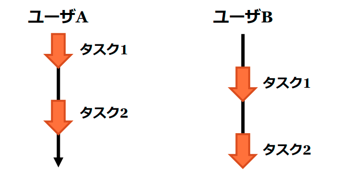
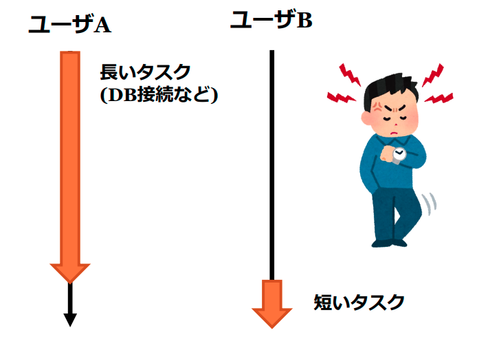
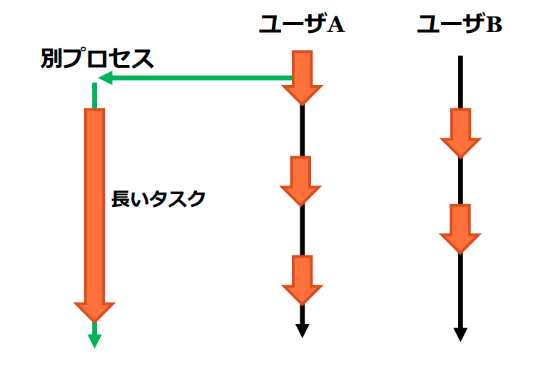
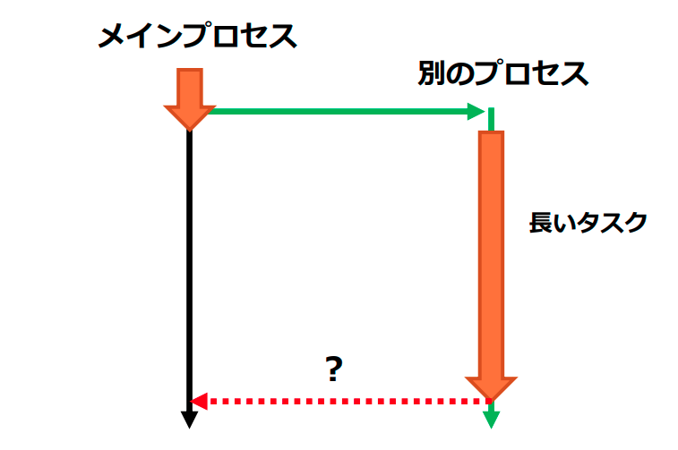
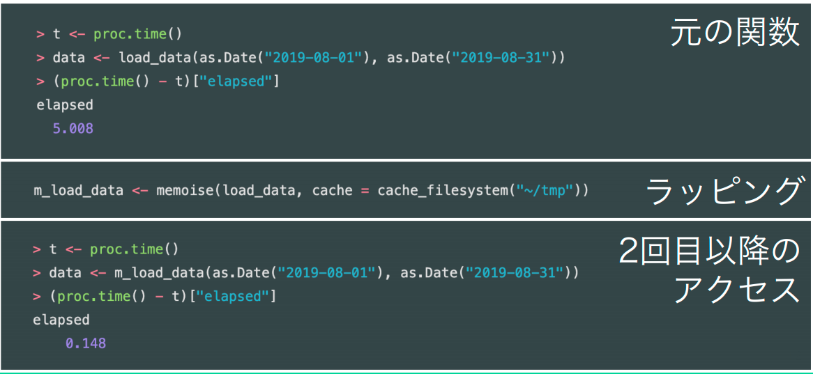
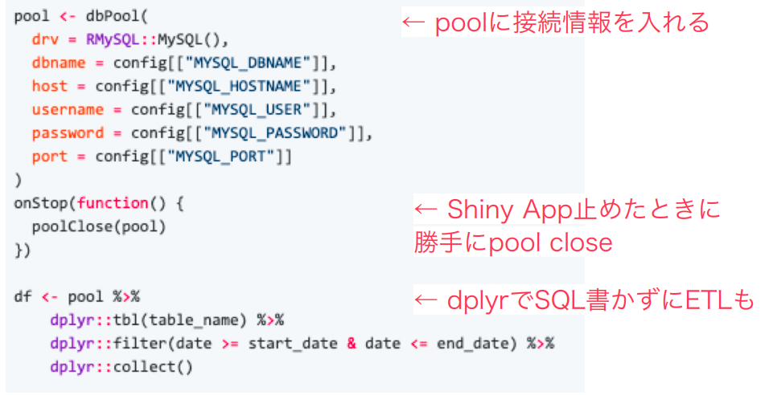
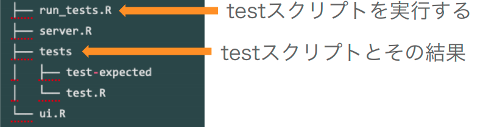
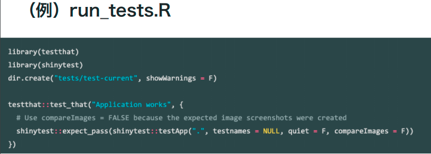
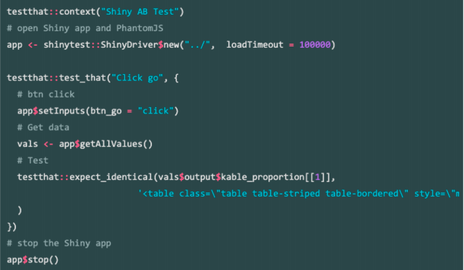

```{r setup, include=FALSE}
options(htmltools.dir.version = FALSE)
knitr::opts_chunk$set(echo = FALSE, fig.align = "center")
library(knitr);library(DT)
```


layout: true

<div class="my-footer"><span><a href="https://www.zarathu.com">Zarathu Co.,Ltd</a>   
&emsp;&emsp;&emsp;&emsp;&emsp;&emsp;&emsp;&emsp;&emsp;&emsp;&emsp;&emsp;&emsp;
&emsp;&emsp;&emsp;&emsp;&emsp;&emsp;&emsp;&emsp;&emsp;&emsp;&emsp;&emsp;&emsp;
<a href="https://github.com/jinseob2kim">김진섭</a></span></div> 


---

# Executive Summary 

.large[
일본 R 밋업 중 하나인 [TokyoR](https://tokyor.connpass.com/) 중 [81회 shiny 특집](https://tokyor.connpass.com/event/141318/)을 리뷰하였다.
]

--
.large[
- 초심자세션: [R](https://speakerdeck.com/kilometer/tokyo-dot-r-number-81-introduction-and-demonstration)과 [shiny 기초](https://speakerdeck.com/kyyonko/di-81hui-tokyor-chu-xin-zhe-setusiyon2-hazimetefalseshiny-80e4f56b-198d-4d7d-a4e0-df1097aa226d)를 다루었다.
]
--

.large[
- 응용세션1: [비동기 프로그래밍](https://www.slideshare.net/hoxo_m/shiny-177170789), [30분만에 적당히 사용할 shiny 앱 만들기](https://randpy-testserver.shinyapps.io/Slide/) 를 다루었다. 
]
--

.large[
- 응용세션2: [leaflet 이용 지도앱 만들기](https://www.slideshare.net/kashitan/shinyleaflettips-177070514), [shiny앱을 지탱하는 엔지니어링 패키지](https://speakerdeck.com/okiyuki99/190928-tokyor81-shiny) 를 다루었다. 
]
--

.large[
- LT: [Shiny로 만드는 사진편집앱](https://igjit.github.io/slides/2019/09/shinyroom/), [Shiny로 사내용 범용 통계 앱 만들기](https://slack-files.com/T06PCFXL2-FNULHJB2R-fe31d13827), 오픈소스 약물동태 시뮬레이션, [shiymeta로 재현가능한 R code 생성하기](https://docs.google.com/presentation/d/1aHRVEE05L7HO90TsTTFNsJZsVH-oI2umYlNR3NuXbac/edit) 등을 다루었다. 
]


---

class: center, middle

# 초심자세션


---
# R 기초

https://speakerdeck.com/kilometer/tokyo-dot-r-number-81-introduction-and-demonstration

.large[
- 공학박사 미무라, 행동신경과학/뇌 이미징 전공

- R 10년 이용

- RStudio 이용법, 기본 연산자, Readable code 를 위한 tidyverse 생태계 강조.
]


---
# 시작하는 shiny

https://speakerdeck.com/kyyonko/di-81hui-tokyor-chu-xin-zhe-setusiyon2-hazimetefalseshiny-80e4f56b-198d-4d7d-a4e0-df1097aa226d?slide=2

.large[
- Twitter @kyyonko, 도내 IT 기업 근무, 데이터과학자로 위장한 그저 수집가.

- shiny 소개 및 uu/server 작성방법.

- 배포방법: shiny server, shinyapps.io, RStudio Connect
]


---

class: center, middle

# 응용세션 1

---
# 비동기 프로그래밍

https://www.slideshare.net/hoxo_m/shiny-177170789

.large[
- Twitter @hoxo_m, 마키야 마코우지, AI회사 hoxo m 대표. 

- Shiny 에서 복수유저의 요청을 처리할 필요성.

- [future](https://github.com/HenrikBengtsson/future), [promises](https://rstudio.github.io/promises/) 패키지 
]

---
# Shiny 복수유저 처리 방법

사용자 요청을 잘게 나눈 후 번갈아가면서 실행. 

<center>

</center>

---
# 긴 작업 있으면 다 밀림

예) DB 접속

<center>

</center>


---
# 비동기: 긴 작업은 별도 프로세스

다른 사용자의 대기시간을 줄일 수 있다.

<center>

</center>


---
# future: 비동기작업 실행

```r
library(future);library(promises)
plan(multisession) # multicore

## Original
output$table <- renderTable(long_task() %>% head(input$n))

## Future
*output$table <- renderTable(future({ long_task()}) %...>% head(input$n))
```

.large[
비동기 코드는 다른 프로세스에서 실행된다! 메인프로세스의 리소스 활용 불가
]


---
# promises: `%...>%`

비동기결과 취득은 어떻게?

<center>

</center>


---
# 똑같이 renderXXX 에 넣으면 됨.

```r
output$table <- reanderTable({
  future({ read.csv(filepath) })
})
```

추가작업은 `%>%` 가 아닌 `%...>%` 로 수행

```r
output$table <- reanderTable({
  future({ read.csv(filepath) }) %...>%
  filter(date == input$date)
})
```

---
# [future.apply](https://github.com/HenrikBengtsson/future.apply) 패키지 

.large[
future 를 이용한 apply 함수들 모음. 멀티코어 지원

- 윈도/맥/리눅스에서 **동일한 코드**로 멀티코어 지원.
]

```{r, echo=T, cache=T}
library(future.apply)
plan(multisession)
system.time(
  future_lapply(1:4, function(x){Sys.sleep(1)})
)
```


---
# 30분만에 shiny 앱 만들기

https://randpy-testserver.shinyapps.io/Slide

.large[
- Twitter @Np-Ur, 데이터분석가, [블로그](https://www.randpy.tokyo/)

- 본인이 만든 shiny 앱 내용 소개

- DT, shinycssloader, withProgress

- [Bookmark](https://shiny.rstudio.com/articles/bookmarking-state.html): **현재 앱 설정상태**를 url로 저장 가능.

]

---

class: center, middle

# 응용세션 2


---
# [leaflet](https://rstudio.github.io/leaflet/) 지도앱 만들기

https://www.slideshare.net/kashitan/shinyleaflettips-177070514

.large[
- 타카시 키타노, 컨설턴트

- `updateSelectInput`: Input 업데이트

- `leafletProxy`: 지역 바꿀 때마다 지도 zoom 리셋

- `fitBounds`: 지역 바꿀 때마다 지도 경계 자동세팅

- `input${id}_shape_click`: 지도의 장소 클릭하면 이름 보여줌.

]


---
# [Census viewer](https://kashitan.shinyapps.io/census_viewer/)


<center>
<iframe src="https://kashitan.shinyapps.io/census_viewer/" width=100%, height = 500>
</center>


---
# shiny앱을 지탱하는 패키지

https://speakerdeck.com/okiyuki99/190928-tokyor81-shiny

.large[
- 미토유키 오키, LINE 데이터과학자 

- [memoise](https://github.com/r-lib/memoise): 데이터 읽기 고속화

- [pool](https://github.com/rstudio/pool): shiny DB 커넥션 관리 

- [ShinyProxy](https://www.shinyproxy.io/): Shiny앱 도커 배포  

- [Shinyloadtest](https://rstudio.github.io/shinyloadtest/): shiny앱 테스트 

- [Shinytest](https://rstudio.github.io/shinytest/articles/package.html): R 패키지에 있는 shiny앱 테스트 
]


---
# [A/B 테스트 샘플수 계산기](https://okiyuki.shinyapps.io/ShinyAB/)


<center>
<iframe src="https://okiyuki.shinyapps.io/ShinyAB/" width=100%, height = 500>
</center>

---
# [memoise](https://github.com/r-lib/memoise)

반복해서 불러오는 것을 cache

<center>

</center>

---
# [pool](https://github.com/rstudio/pool): 쉬운 DB 접속관리

Shiny에서 DB 접속관리 고통스럽다.

- 예) DB에서 불러오는 도중 앱이 닫혀서 DB 연결이 남아있음.


<center>

</center>


---
# [Shinytest](https://rstudio.github.io/shinytest/articles/package.html): shiny앱 테스트 

R 패키지에 테스트 코드 넣을 수 있다. 

<center>


</center>

---
# test.R

<center>

</center>

---

class: center, middle

# LT

---
# 사진편집앱


---
# 사내용 범용 통계 앱


---
# [shiymeta](https://github.com/rstudio/shinymeta): Reproducible R code


---

# Executive Summary 

.large[
일본 R 밋업 중 하나인 [TokyoR](https://tokyor.connpass.com/) 중 [81회 shiny 특집](https://tokyor.connpass.com/event/141318/)을 리뷰하였다.

- 초심자세션: [R](https://speakerdeck.com/kilometer/tokyo-dot-r-number-81-introduction-and-demonstration)과 [shiny 기초](https://speakerdeck.com/kyyonko/di-81hui-tokyor-chu-xin-zhe-setusiyon2-hazimetefalseshiny-80e4f56b-198d-4d7d-a4e0-df1097aa226d)를 다루었다.


- 응용세션1: [비동기 프로그래밍](https://www.slideshare.net/hoxo_m/shiny-177170789), [30분만에 적당히 사용할 shiny 앱 만들기](https://randpy-testserver.shinyapps.io/Slide/) 를 다루었다. 

- 응용세션2: [leaflet 이용 지도앱 만들기](https://www.slideshare.net/kashitan/shinyleaflettips-177070514), [shiny앱을 지탱하는 엔지니어링 패키지](https://speakerdeck.com/okiyuki99/190928-tokyor81-shiny) 를 다루었다. 

- LT: [Shiny로 만드는 사진편집앱](https://igjit.github.io/slides/2019/09/shinyroom/), [Shiny로 사내용 범용 통계 앱 만들기](https://slack-files.com/T06PCFXL2-FNULHJB2R-fe31d13827), 오픈소스 약물동태 시뮬레이션, [shiymeta로 재현가능한 R code 생성하기](https://docs.google.com/presentation/d/1aHRVEE05L7HO90TsTTFNsJZsVH-oI2umYlNR3NuXbac/edit) 등을 다루었다. 
]

---

class: center, middle

# END
