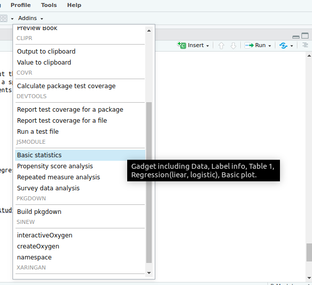
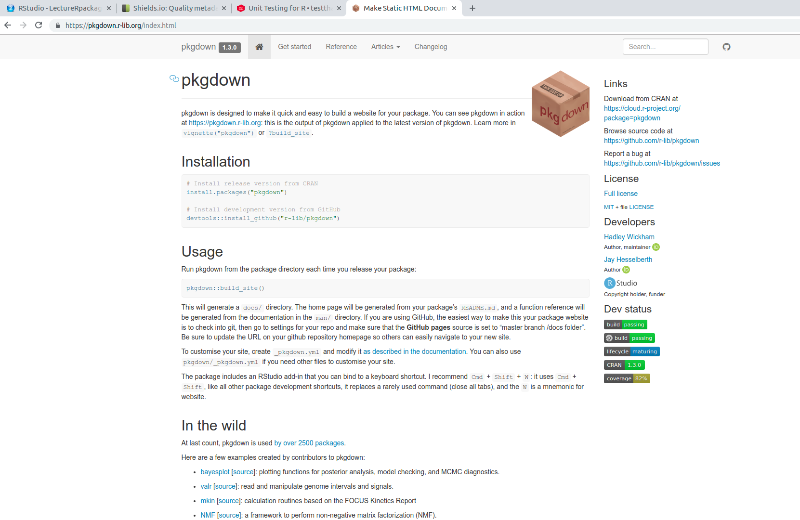
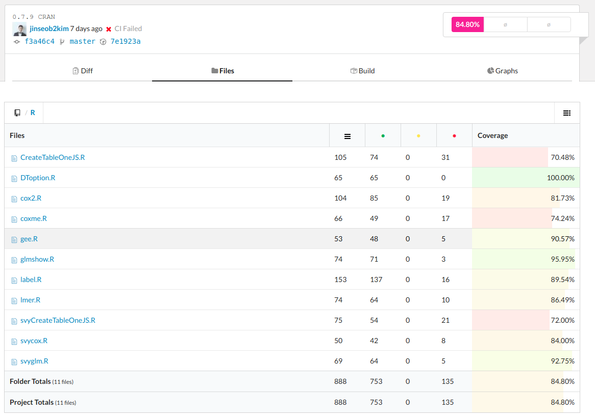

```{r setup, include=FALSE}
options(htmltools.dir.version = FALSE)
knitr::opts_chunk$set(echo = FALSE, fig.align = "center")
library(knitr);library(DT);library(dplyr);library(data.table);library(rmarkdown);library(readr);library(purrr);library(tidyr)
```

```{r, load_refs, echo=FALSE, cache=FALSE}
library(RefManageR)
BibOptions(check.entries = FALSE, 
           bib.style = "numeric", 
           cite.style = 'numeric', 
           style = "markdown",
           hyperlink = "to.doc", 
           dashed = FALSE)
myBib <- ReadBib("./ref.bib", check = FALSE)
```

layout: true

<div class="my-footer"><span><a href="https://www.anpanman.co.kr">ANPANMAN Co.,Ltd</a>   
&emsp;&emsp;&emsp;&emsp;&emsp;&emsp;&emsp;&emsp;&emsp;&emsp;&emsp;&emsp;&emsp;
&emsp;&emsp;&emsp;&emsp;&emsp;&emsp;&emsp;&emsp;&emsp;&emsp;&emsp;&emsp;&emsp;
<a href="https://github.com/jinseob2kim">김진섭</a></span></div> 


---
# Executive Summary 

개인 PC에서 직접 **ShinyApps**를 이용할 수 있도록 

--

1. **ShinyApps**을 **[Rstudio Addins](https://rstudio.github.io/rstudioaddins/)**으로 만든 후, 이를 패키지로 만들어 **github**에 배포하였다.

--

2. **[testthat](https://github.com/r-lib/testthat)**, **[covr](https://github.com/r-lib/covr)**로 코드 테스트를 수행하고 결과 리포트를 만들었으며, **[pkgdown](https://github.com/r-lib/pkgdown)**로 패키지를 소개하는 웹사이트를 만들었다. 

--

3. **[Travis CI](https://travis-ci.org/)**와 **[appveyor](https://www.appveyor.com/)**로 2의 과정과 여러 운영체제에서의 테스트를 자동화하였다. 

--

4. 최종적으로 **[CRAN](https://cran.r-project.org/)**에 패키지를 배포하였다. 


---
# ShinyApps

```{r, fig.cap = "Basic statistics", out.width="100%"}
include_graphics("https://camo.githubusercontent.com/aa4156b420be17d5ee0c39271486d13db4886712/68747470733a2f2f636f6d6d756e6974792e7273747564696f2e636f6d2f75706c6f6164732f64656661756c742f6f7074696d697a65642f32582f652f653134333064663830376335313335656437613234666565396639626238633339303330373831315f315f363930783336302e676966")
```

Figure from `r Citet(myBib, "Takeuchi2018")`

---
# Rstudio Addins

```{r, fig.cap = "Rstudio Addins: jsmodule packages", out.width="100%"}
include_graphics("https://camo.githubusercontent.com/96f270fef715ed29c4799a165e6de679def95c92/68747470733a2f2f626c6f672e616e70616e6d616e2e636f2e6b722f706f7374732f323031382d31312d32342d62617369632d62696f737461746973746963732f616464696e2e676966")
```

---

# R packages

.large[
[jsmodule](https://github.com/jinseob2kim/jsmodule): RStudio Addins와 Shiny Modules.
]

--
.large[
Dependencies

- [jstable](https://github.com/jinseob2kim/jstable): 회귀분석 테이블([CRAN](https://cran.r-project.org/package=jstable))

- [jskm](https://github.com/jinseob2kim/jskm): 카플란-마이어(Kaplan-meier) 그림([CRAN](https://cran.r-project.org/package=jskm))

]

---

class: center, middle

# WHY

---
# 파일제한 5메가

Shiny `fileInput`은 5메가 이하까지만 지원. 

--

사실, 용량 제한 바꿀 수 있음. `shiny.maxRequestSize` 옵션을 **app.R**에 추가.


```{r, echo=T, eval = F}
## change to 30mb
*options(shiny.maxRequestSize = 30*1024^2)

ui <- navbarPage("Basic statistics",
                   tabPanel("Data",
                            
```

--

서버 부하가 부담. 큰 데이터는 개인 컴퓨터에서 직접 하면 좋겠다. 

---
# 인터넷 차단 환경

건강보험 빅데이터 분석실은 인터넷 접속이 원천차단. 

- **R**, **Rstudio**, **Rpackage** 파일을 직원에게 미리 보내야 함. 

--

심평원 분석실은 CRAN은 다운가능, github은 불가능.

--

데이터 정리까지만 수행, 분석은 연구자가 직접 할 수 있도록 계획.


---

class: center, middle

# [Rstudio Addins](https://rstudio.github.io/rstudioaddins) 만들기

---

# 데이터를 입력변수로 받는 함수 만들기. 

- ShinyApps의 `fileInput`을, **R**에서 데이터 읽는 것으로 바꿈. 

--

```{r, echo=T, eval=F}
## app.R in ShinyApps
server <- function(input, output, session) {

  output$import <- renderUI({
*   csvFileInput("datafile")
    
  })
  
* data.info <- callModule(csvFile, "datafile")
  data <- reactive(data.info()$data)
  data.label <- reactive(data.info()$label)
  ...
}

* shinyApp(ui, server)
```

---

```{r, echo =T, eval = F}
## Addin function

jsBasicGadget <- function(data, nfactor.limit = 20) {

* out <- data.table(data, check.names = T)


  ui <- navbarPage("Basic statistics",
                   tabPanel("Data",
                   ...)
        )
  
  server <- function(input, output, session) {
     ...
    }
  
*  viewer <- browserViewer(browser = getOption("browser"))
*  runGadget(ui, server, viewer = viewer)
  
```

--
**Viewer options**

- `paneViewer()`: Rstudio 우측 아래 **Viewer**

- `dialogViewer()`: 따로 창을 실행

- `browserViewer()`: 따로 브라우저 실행


https://github.com/jinseob2kim/jsmodule/blob/master/R/jsBasicGadget.R


---
# [miniUI](https://github.com/rstudio/miniUI)

- Gadget용 간소화된 UI

```{r, fig.cap = "minuUI", out.width="80%"}
include_graphics("https://github.com/rstudio/miniUI/raw/master/tools/tabs.gif")
```

---

```{r, echo = T, eval = F, out.width="50%"}
ui <- miniPage(
  gadgetTitleBar("Shiny gadget example"),
  miniTabstripPanel(
    miniTabPanel("Parameters", icon = icon("sliders"),
      miniContentPanel(
        sliderInput("year", "Year", 1978, 2010, c(2000, 2010), sep = "")
      )
    ),
    miniTabPanel("Visualize", icon = icon("area-chart"),
      miniContentPanel(
        plotOutput("cars", height = "100%")
      )
    ),
    miniTabPanel("Map", icon = icon("map-o"),
      miniContentPanel(padding = 0,
        leafletOutput("map", height = "100%")
      ),
      miniButtonBlock(
        actionButton("resetMap", "Reset")
      )
    ),
    miniTabPanel("Data", icon = icon("table"),
      miniContentPanel(
        DT::dataTableOutput("table")
      )
    )
  )
)

```


---
# 그러나 난..

.large[
미리 만든 ShinyApps와 동일한 환경을 원함.

- [miniUI](https://github.com/rstudio/miniUI) 안함 : ShinyApps의 UI 코드 그대로 이용. 

- `browserViewer()` 사용 : 웹브라우저에서 실행.

]

---
# Addin 함수 만들기

- 드래그된 데이터이름을 인식하여 Gadget을 실행함

```{r, echo=T, eval=F}

jsBasicAddin <- function(){
* context <- rstudioapi::getActiveDocumentContext()
  # Set the default data to use based on the selection.
  dataString <- context$selection[[1]]$text
* data <- get(dataString, envir = .GlobalEnv)
  jsBasicGadget(data)
}
```


|   |   |
|---|---|
| `getActiveDocumentContext()`  |  Returns information about the currently active RStudio document. |
| `insertText(location, text, id = NULL)` | Insert text at a specific location within a document.  |
| `setDocumentContext(text, id = NULL)`   | 	Set the contents of a document open in RStudio.  |


---
# **addins.dcf** 파일 만들기. 

R 패키지 `inst/rstudio/addins.dcf` 에 만들기. 

```sh
Name: Basic statistics
Description: Gadget including Data, Label info, Table 1, Regression(liear, logistic), Basic plot.
Binding: jsBasicAddin
Interactive: true
```

https://github.com/jinseob2kim/jsmodule/blob/master/inst/rstudio/addins.dcf

---

```{r, fig.cap = "Addin tab", out.width="80%"}

```


---

class: center, middle

# R package 관리


---
# 패키지 상태 표현: Badge

[](https://travis-ci.org/jinseob2kim/jstable) [](https://ci.appveyor.com/project/jinseob2kim/jstable) [](https://cran.r-project.org/package=jstable) [](https://CRAN.R-project.org/package=jstable) [](https://codecov.io/github/jinseob2kim/jstable) [](https://github.com/jinseob2kim/jstable/issues) [](https://github.com/jinseob2kim/jstable/stargazers) [](https://github.com/jinseob2kim/jstable/blob/master/LICENSE)

```md
[](https://travis-ci.org/jinseob2kim/jstable) 
[](https://ci.appveyor.com/project/jinseob2kim/jstable) 
[](https://cran.r-project.org/package=jstable)
[](https://CRAN.R-project.org/package=jstable) [](https://codecov.io/github/jinseob2kim/jstable) [](https://github.com/jinseob2kim/jstable/issues) 
[](https://github.com/jinseob2kim/jstable/stargazers) 
[](https://github.com/jinseob2kim/jstable/blob/master/LICENSE)
```

https://shields.io/ 에서 내 상태에 해당하는 뱃지를 얻을 수 있다.
--

- **오류는 없고**, **인기는 많은** 패키지임을 과시?

---
# 패키지 설명: 홈페이지 

```{r,  out.width="80%"}

```

https://jinseob2kim.github.io/jskm/, https://jinseob2kim.github.io/jstable/, https://jinseob2kim.github.io/jsmodule/

---
# 홈페이지, test coverage를 자동으로 만들자.

.large[
- 홈페이지: [pkgdown](https://pkgdown.r-lib.org/)

- test coverage: [testthat](http://testthat.r-lib.org/), [covr](https://covr.r-lib.org/)

- 자동 배포: [travis-ci](https://travis-ci.org/), [appveyor](https://www.appveyor.com/)
]


---
# [pkgdown](https://pkgdown.r-lib.org/)

패키지 설치 후 `_pkgdown.yml` 파일에서 셋팅 

```yaml
URL: https://jinseob2kim.github.io/jskm, https://github.com/jinseob2kim/jstable

development:
  mode: auto
  
authors:
  Jinseob Kim:
    href: https://github.com/jinseob2kim
  Anpanman:
    href: https://www.anpanman.co.kr
    html: 


template:
  params:
    docsearch:
      api_key: f6ab1678f68371b7775614662cffcb9d
      index_name: jstable

```

---
# 홈페이지 만들기 

`build_site()` 실행하면 **/docs** 폴더에 홈페이지 만들어짐. 


```{r, fig.cap="Setting webpage in github", out.width="60%"}
include_graphics("https://github.blog/wp-content/uploads/2016/08/d516076e-640c-11e6-8086-ce1d246a87d2.png?fit=1460%2C860")
```

나중엔 [travis-ci](https://travis-ci.org/)를 이용, **gh-pages** 브랜치에 자동 배포.


---
# [testthat](http://testthat.r-lib.org/)

함수의 테스트 코드를 작성하고 평가.

- `usethis::use_testthat(), use_test()`로 기본 테스트 생성. `devtools::test()`로 테스트.

```r
context("Show regression table")

test_that("Run glmshow.display", {
  expect_is(glmshow.display(glm(mpg ~ cyl, data = mtcars)), "display")
  expect_is(glmshow.display(glm(am ~ cyl, data = mtcars, family = "binomial")), "display")
})

test_that("Run cox2.display", {
  library(survival);data(lung)
  fit0 <- coxph(Surv(time, status) ~ ph.ecog + age, data = lung, model = TRUE)
  fit1 <- coxph(Surv(time, status) ~ ph.ecog + age + cluster(inst), data = lung, model = TRUE)
  fit2 <- coxph(Surv(time, status) ~ ph.ecog + age + frailty(inst), data = lung, model = TRUE)
  
  expect_is(cox2.display(fit0), "list")
  expect_is(cox2.display(fit1), "list")
  expect_is(cox2.display(fit2), "list")      
})
```


---
# [covr](https://covr.r-lib.org/)

코드 테스트 리포트를 제공하는 [Codecov](https://codecov.io/)나 [Coveralls](https://coveralls.io/)를 위한 R 패키지.

- `covr::codecov(), coverall()` 로 실행.

- [testthat](http://testthat.r-lib.org/) 결과 기반 리포트. https://codecov.io/gh/jinseob2kim/jstable/tree/master/R

```{r, out.width="75%"}

```


---
# 귀찮다

.large[
업데이트 때마다 **홈페이지**와 **코드리포트** 만들기 싫다. 
]

--

.large[
사실, 패키지 **빌드(build) 체크**도 하기 싫다. 그러나 필요하다.

- 내 컴퓨터에서 체크해봤자 리눅스환경만 확인한 것임. 

- 맥이나 윈도우에서 실행이 보장안됨.

]

---
# [travis-ci](https://travis-ci.org/): 빌드, 배포 자동화

---
class: center, middle

# CRAN 배포


---

class: center, middle

# END

---

# References

```{r, 'refs', results='asis', echo=FALSE}
PrintBibliography(myBib)
```
