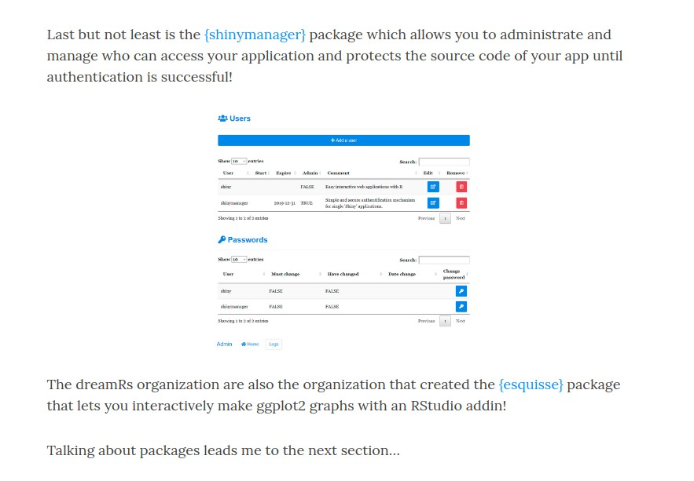

exclude: true

<style type="text/css">
code.r{
  font-size: 16px;
}
pre {
  font-size: 16px !important;
}
</style>

```{r setup, include=FALSE}
options(htmltools.dir.version = FALSE)
knitr::opts_chunk$set(echo = FALSE, fig.align = "center")
library(knitr);library(DT);library(dplyr);library(data.table);library(rmarkdown);library(readr);library(purrr);library(tidyr)
```


---
class: middle bg-main1

# Executive Summary 

<br>

### [shinymanager](https://github.com/datastorm-open/shinymanager) 로 .yellow[UI 종류에 상관없이], 간단하게 로그인기능을 추가한다.


### [SQLite db](https://db.rstudio.com/databases/sqlite/) 를 이용, 접속자와 그 log를 관리한다.


---
class: middle bg-main1

# [shinymanager](https://github.com/datastorm-open/shinymanager) 없던 시절..


---
class: bg-main1

# 직접 만들기 

### `passwordInput` in shiny


### 뭔가 아쉽다.


---
class: bg-main1

# [Google Auth0](https://auth0.com/blog/adding-authentication-to-shiny-server/) 

```{r, out.width="50%"}
include_graphics("https://raw.githubusercontent.com/zarathucorp/dhh2018/master/img/auth0.gif")
```

### 복잡, App 별로 따로 안되는듯.


---
class: bg-main1

# [shinyauthr](https://github.com/PaulC91/shinyauthr)

### 쉬움. https://cultureofinsight.shinyapps.io/shinyauthr/

### navbar UI 에 적용이 어려움. http://app.zarathu.com/pspass/


---
class: bg-main1

# [useR 2019 후기](https://ryo-n7.github.io/2019-07-21-user2019-reflections/)를 읽던 중

```{r, out.width="70%"}

```


---
class: middle bg-main1

# [shinymanager](https://github.com/datastorm-open/shinymanager) 소개


---

class: middle bg-main1


## `install.packages("shinymanager")`
<br>

### Make User info

```
credentials <- data.frame(
  user = c("shiny", "shinymanager"),
  password = c("azerty", "12345"),
  admin = c(T, F),
  stringsAsFactors = FALSE
)
```

### Apply to UI

```
ui <- secure_app(ui, enable_admin = T)
```

### In server

```
res_auth <- secure_server(
    check_credentials = check_credentials(credentials)
  )
```


---
class: middle bg-main1

# How .yellow[should] you use R?


---
class: bg-main1

# Making your R work .yellow[organized] and .yellow[portable]


---

class: bg-main1 split-30 hide-slide-number

.column.bg-main3[
]
.column.slide-in-right[
.sliderbox.bg-main2.vmiddle[
.font5[Split Cells]
]]


---

class: split-two white

.column.bg-main1[.content[
# A .yellow[kunoichi] can use .yellow[ninjutsu] to .green[split columns] easily.
<br>
## Define your classes as*
```{}
class: split-two white
```

## Columns are added easily by 
```{r, eval=F}
{{.column.bg-main1[.content[}}
  content of first column
]]
{{.column.bg-main2[.content[}}
  content of second column
]]
```
]]
.column.bg-main2[.content.vmiddle.center[
# See the R-markdown source file for this slide [here](https://github.com/emitanaka/ninja-theme).
<br><br>
# * class white changes all the font to white
]]