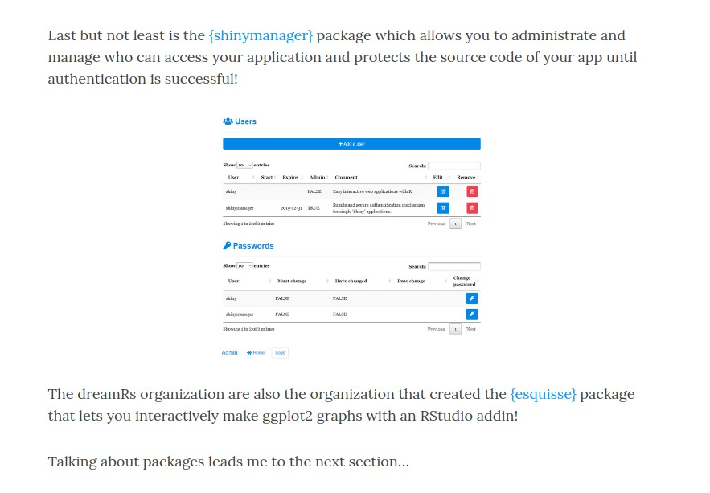
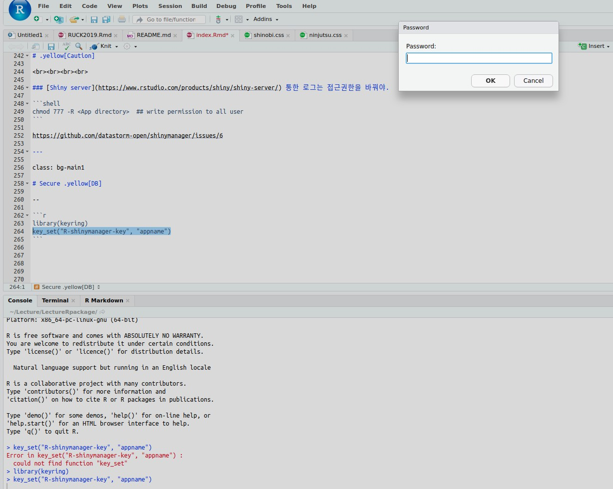

```{r setup, include=FALSE}
options(htmltools.dir.version = FALSE)
knitr::opts_chunk$set(echo = FALSE, fig.align = "center")
library(knitr)
```


class: middle bg-main1

# Executive Summary 

<br>

### [shinymanager](https://github.com/datastorm-open/shinymanager) 로 .yellow[UI 종류에 상관없이], 간단하게 로그인기능을 추가한다.


### [SQLite db](https://db.rstudio.com/databases/sqlite/) 를 이용, 접속자와 그 log를 관리한다.


---
class: middle bg-main1

# [shinymanager](https://github.com/datastorm-open/shinymanager) 없던 시절..


---
class: bg-main1

# 직접 만들기 

### `passwordInput` in shiny


### 뭔가 아쉽다.

http://app.zarathu.com/password-exam/


---
class: bg-main1

# [Google Auth0](https://auth0.com/blog/adding-authentication-to-shiny-server/) 

```{r, out.width="50%"}
include_graphics("https://raw.githubusercontent.com/zarathucorp/dhh2018/master/img/auth0.gif")
```

### 복잡, App 별로 따로 안되는듯.


---
class: bg-main1

# [shinyauthr](https://github.com/PaulC91/shinyauthr)

```{r, out.width="80%"}
include_graphics("https://user-images.githubusercontent.com/30856173/49153332-bb7a0900-f315-11e8-8a06-2375d299a766.png")
```

<br><br>
### 쉬움. https://cultureofinsight.shinyapps.io/shinyauthr/

### navbar UI 에 적용이 어려움. http://app.zarathu.com/basicpass/


---
class: bg-main1

# [useR 2019 후기](https://ryo-n7.github.io/2019-07-21-user2019-reflections/)를 읽던 중

```{r, out.width="70%"}

```


---
class: middle bg-main1

# [shinymanager](https://github.com/datastorm-open/shinymanager) 소개


---
layout: true
class: split-four white

.split-four[
.row.bg-main1[.content[
  `install.packages("shinymanager")`
  
  Demo: http://shinyapps.dreamrs.fr/shinymanager-demo/ (id & password: .yellow[shinymanager])

]]

.row.bg-main2[.content[
### Make User info
  ```
credentials <- data.frame(
  user = c("shiny", "shinymanager"),
  password = c("azerty", "12345"),
  admin = c(T, F), stringsAsFactors = FALSE)
```
]]

.row.bg-main3[.content[
### Apply to UI
```
ui <- secure_app(ui, enable_admin = T)
```
]]


.row.bg-main4[.content[
### In server
```
res_auth <- secure_server(
    check_credentials = check_credentials(credentials)
  )

```
]]
]

---
class: fade-row2 fade-row3 fade-row4
---
class: fade-row1 fade-row3 fade-row4
---
class: fade-row1 fade-row2 fade-row4
---
class: fade-row1 fade-row2 fade-row3
---
class:


---
layout:false
class: bg-main1

# `app.R` Example

```r
credentials <- data.frame(
  user = c("shiny", "shinymanager"),
  password = c("shiny", "shinymanager"),
  stringsAsFactors = FALSE)

library(shiny);library(shinymanager)

ui <- fluidPage(
  tags$h2("My secure application"),
  verbatimTextOutput("auth_output"))

ui <- secure_app(ui)

server <- function(input, output, session) {
  res_auth <- secure_server(
    check_credentials = check_credentials(credentials))
  
  output$auth_output <- renderPrint({
    reactiveValuesToList(res_auth)
  })

}
shinyApp(ui, server)
```

---
layout: false
class:bg-main1

```{r}
include_graphics("https://ryo-n7.github.io/assets/2019-07-21-user2019-reflections_files/shinymanager.PNG")
```

---
class: split-two white

.column.bg-main1[.content[
# `dataframe` 은 .yellow[admin], .yellow[log] 기능 안됨.
<br>

```r
ui <- secure_app(ui, enable_admin = T)
```
## Option doesn't run.

]]
.column.bg-main2[.content.vmiddle.center[
# Need .yellow[DB]: for dynamic update.
<br><br>
# [shinymanager](https://github.com/datastorm-open/shinymanager) supports [RSQLite](https://db.rstudio.com/databases/sqlite/)
<br>

### Simple .yellow[DB] with 1 file


]]


---
layout: true
class: split-two white

.row.bg-main1[.content[
### Make User info: no .yellow[DB]
```
credentials <- data.frame(
  user = c("shiny", "shinymanager"),
  password = c("azerty", "12345"),
  admin = c(T, F), stringsAsFactors = FALSE)
```
### In server
```
res_auth <- secure_server(
    check_credentials = check_credentials(credentials))

```


]]
.row.bg-main2[.content[
### Make User info: .yellow[DB]
```
credentials <- data.frame(
  user = c("shiny", "shinymanager"),
  password = c("azerty", "12345"),
  admin = c(T, F), stringsAsFactors = FALSE)

*create_db(credentials_data = credentials, sqlite_path = "database.sqlite") 
```
### In server
```
res_auth <- secure_server(
*   check_credentials = check_credentials("database.sqlite"))
```

]]

---
class: fade-row2
---
class: fade-row1
---
class:


---
layout: false
class: bg-main1

# .yellow[Caution] 

<br><br><br><br>

### [Shiny server](https://www.rstudio.com/products/shiny/shiny-server/) 통한 로그는 접근권한을 바꿔야.

```shell
chmod 777 -R <App directory>  ## write permission to all user
```

https://github.com/datastorm-open/shinymanager/issues/6


---
class: bg-main1

# Secure .yellow[DB] with [keyring](https://github.com/r-lib/keyring) package


```r
library(keyring)
key_set("R-shinymanager-key", "appname")
```

```{r, out.width="50%"}

```


---
class:bg-main1

# When create .yellow[DB]

```r
create_db(
  credentials_data = credentials,
  sqlite_path = "database.sqlite", 
* passphrase = key_get("R-shinymanager-key", "appname")
)
```

--
# .yellow[Caution]

.blockquote.font_large[
Linux 에선 key 가 `environment variables` 로 저장됨.<br><br>
Shiny server 에도 적용하려면 user `shiny` 에도 `environment variables` 추가해야 함.
]

---
class: bg-main1 center
#Thanks!


